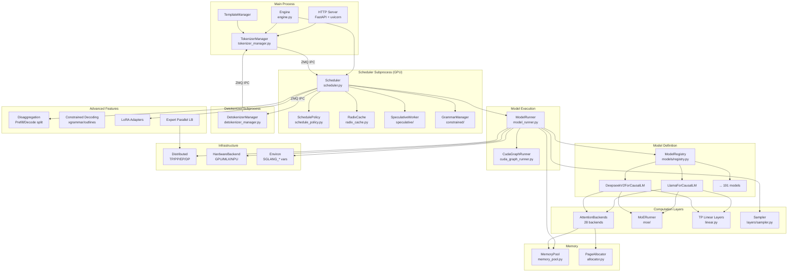
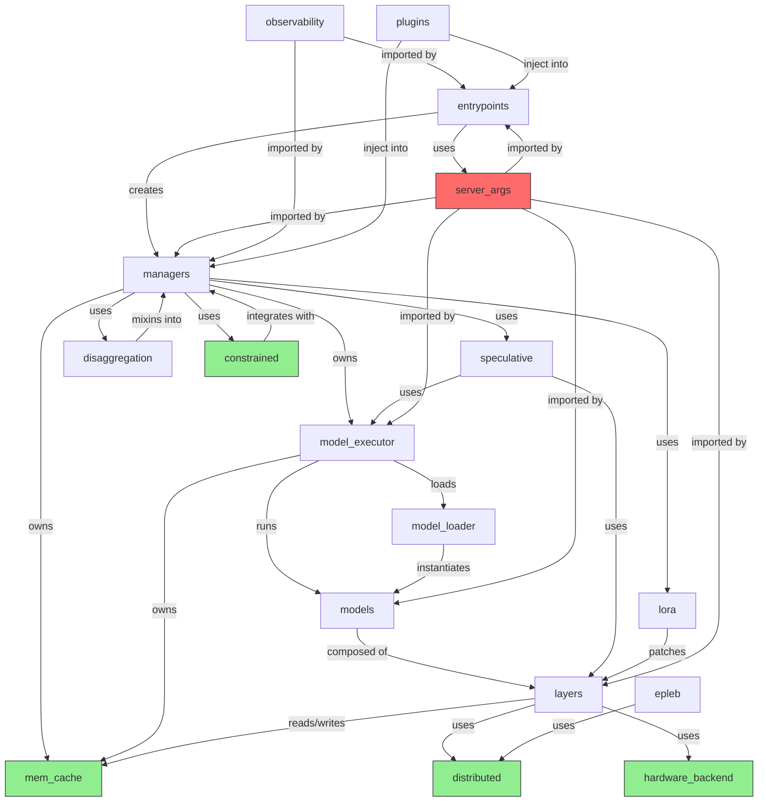

# Architecture And Module Boundaries

## 1. Architecture Summary

| Pattern | Evidence | Why It Fits | Confidence |
|---|---|---|---|
| **Layered Architecture** | engine.py:174-186 (Engine -> TokenizerManager -> Scheduler -> DetokenizerManager) | Clean separation: HTTP/API -> tokenization -> scheduling -> model execution -> detokenization | High |
| **Subprocess Microkernel** | engine.py:84-85 (mp.Process for scheduler), engine.py:47 (ZMQ IPC) | Three processes communicating exclusively via ZMQ message passing; shared-nothing IPC | High |
| **Plugin-based Extension** | plugins/__init__.py:28-29 (entry_points groups), attention_registry.py:23-29 (register_attention_backend) | Both hardware platforms and general features register through setuptools entry_points or decorator registries | High |
| **Mixin-based Composition** | scheduler.py:324-337 (12+ mixins inheriting into Scheduler) | Capabilities composed via Python multiple inheritance rather than god class | High |
| **Model Registry Pattern** | models/registry.py:131 (ModelRegistry.resgister) | Auto-discovers model classes via pkgutil, factory pattern for model instantiation | High |
| **Strategy Pattern (Backends)** | attention_registry.py:23, constrained/base_grammar_backend.py | Attention backends, grammar backends, MoE backends, transfer backends all follow Strategy pattern | High |
| **Pipeline Architecture** | managers/ organization: tokenizer -> scheduler -> detokenizer, forward_batch_info.py | Data flows through a sequence of processing stages | High |

### Architecture Verdict
SGLang employs a **layered, plugin-based architecture with subprocess isolation**. The core is a pipeline of independent processes (TokenizerManager -> Scheduler -> DetokenizerManager) communicating via ZMQ IPC. Within the Scheduler process, capabilities are composed via mixins. Backends (attention, MoE, quantization, grammar, transfer) use the Strategy pattern enabling runtime selection. The system is designed for extensibility: new models auto-register, new attention backends register via decorator, and plugins inject via setuptools entry_points.

## 2. Module Inventory

| Module | Path | Responsibility | Public Surface | Dependencies | Cohesion/Coupling |
|---|---|---|---|---|---|
| **entrypoints** | srt/entrypoints/ | Server bootstrap, HTTP/gRPC/Engine API | Engine, EngineBase, launch_server, HTTP routes | managers, server_args | Medium / High (depends on everything) |
| **managers** | srt/managers/ | Request lifecycle, scheduling, tokenization, IPC | Scheduler, TokenizerManager, DetokenizerManager, ScheduleBatch, Req | model_executor, mem_cache, layers | High / Medium |
| **model_executor** | srt/model_executor/ | Model forward pass orchestration | ModelRunner, CudaGraphRunner, ForwardBatch | layers, models, configs, mem_cache | High / High (central orchestrator) |
| **model_loader** | srt/model_loader/ | Model weight loading and initialization | DefaultModelLoader, get_model_loader | models, layers.quantization | High / Low |
| **models** | srt/models/ | 191 HuggingFace model implementations | LlamaForCausalLM, DeepseekV2ForCausalLM, etc. | layers, configs | Medium / Low (each model is independent) |
| **layers** | srt/layers/ | Reusable layer components | RadixAttention, ColumnParallelLinear, Sampler, MoE runners | mem_cache, distributed | High / Low (pure computation) |
| **mem_cache** | srt/mem_cache/ | KV cache, radix cache, memory pools | RadixCache, ReqToTokenPool, TokenToKVPoolAllocator, MemoryPool | None (leaf module) | High / Low (pure data structure) |
| **constrained** | srt/constrained/ | Grammar-constrained decoding | GrammarManager, BaseGrammarBackend, XGrammarBackend | None (leaf) | High / Low |
| **speculative** | srt/speculative/ | Speculative decoding (Eagle, NGram, etc.) | EagleWorker, NGramWorker, BaseSpecWorker, SpecRegistry | model_executor, layers | Medium / Medium |
| **disaggregation** | srt/disaggregation/ | Prefill-decode separation | PrefillMixin, DecodeMixin, CommonKVManager, TransferBackends | managers, mem_cache | Medium / Medium |
| **sampler** | srt/sampler/ | Token sampling strategies | Sampler (via layers/sampler.py) | None | High / Low |
| **tokenizer** | srt/tokenizer/ | Tokenizer wrappers | get_tokenizer, DynamicBatchTokenizer | None | Medium / Low |
| **connector** | srt/connector/ | Remote model connector | RemoteConnector, S3Connector | model_loader | Low / Low |
| **multimodal** | srt/multimodal/ | Image/video/audio processing | MultimodalProcessor, ImageProcessor | None | Medium / Low |
| **lora** | srt/lora/ | LoRA adapter management | LoRAManager, LoRALayer, LoRARegistry | layers | High / Low |
| **distributed** | srt/distributed/ | TP/PP/EP/DP parallelism | init_distributed_environment, get_tp_group, parallel_state | None | High / Low |
| **eplb** | srt/eplb/ | Expert parallel load balancing | EPLBManager, ExpertDistributionRecorder | distributed | Medium / Medium |
| **elastic_ep** | srt/elastic_ep/ | Elastic expert parallelism | ElasticEPStateManager, ExpertBackupClient | distributed | Medium / Medium |
| **hardware_backend** | srt/hardware_backend/ | Hardware-specific backends | GPU, MLX (Apple), MUSA, NPU (Huawei) implementations | None | Medium / Low |
| **observability** | srt/observability/ | Metrics, logging, tracing | Prometheus metrics, OpenTelemetry tracing | None | Medium / Low |
| **configs** | srt/configs/ | Model and device configuration | ModelConfig, DeviceConfig, LoadConfig | layers, models | Medium / Medium |
| **server_args** | srt/server_args.py | All server configuration (7950 lines) | ServerArgs, PortArgs | environ | Low / High (global dependency) |
| **environ** | srt/environ.py | Environment variable management | EnvField descriptors for SGLANG_* variables | None | High / Low |
| **compilation** | srt/compilation/ | torch.compile integration | CompilationConfig, compilation passes | model_executor | Low / Low |
| **grpc** | srt/grpc/ | gRPC protocol definitions | Protobuf stubs | Rust backend | Low / Low |
| **session** | srt/session/ | Session management for multi-turn | SessionManager | managers | Low / Low |
| **multiplex** | srt/multiplex/ | Multi-model serving | MultiplexMixin | managers | Low / Medium |
| **plugins** | srt/plugins/ | Plugin framework (hooks, entry_points) | load_plugins, HookRegistry, register_hook | None | High / Low |

## 3. Layer Analysis

| Layer | Directories | Responsibility | Allowed Dependencies | Violations |
|---|---|---|---|---|
| **API/Entrypoint** | entrypoints/ | HTTP routes, Engine API, gRPC server | managers (via IPC), server_args | None observed |
| **Orchestration** | managers/ | Request lifecycle, scheduling, IPC | model_executor, mem_cache, layers, speculative, disaggregation | Large but appropriate for orchestrator |
| **Execution** | model_executor/ | Model forward pass, CUDA graphs, batch management | layers, models, configs, mem_cache, sampler, distributed | Tight coupling to layers/models (expected) |
| **Computation** | layers/ | Attention, MoE, linear, quantization, sampling | mem_cache (for KV cache), hardware_backend | mem_cache reference is via attention backends only |
| **Domain** | models/ | Model architecture implementations | layers (for components), configs | Each model imports layers — correct direction |
| **Infrastructure** | mem_cache/, distributed/, hardware_backend/ | Memory management, parallelism, hardware | None (leaf modules) | Clean leaf modules |
| **Cross-cutting** | constrained/, speculative/, disaggregation/, lora/, eplb/ | Advanced features | model_executor, layers, managers | Appropriate cross-cutting dependencies |
| **Configuration** | server_args.py, environ.py, configs/ | System configuration | Everywhere (server_args is god object) | **Violation**: server_args.py depends on all modules |

### Key Architecture Observation: server_args.py God Object

`server_args.py` at 7,950 lines is the single largest file and a **god configuration object**. It:
- Imports from nearly every srt submodule (connector, function_call, layers, lora, parser, etc.)
- Defines a single `ServerArgs` dataclass with hundreds of fields
- Creates a circular dependency concern: every module depends on ServerArgs, but ServerArgs depends on them for type resolution

**Risk**: High coupling around configuration. Any module addition requires touching this file.

## 4. Dependency Direction Analysis

| From | To | Type | Evidence | Risk |
|---|---|---|---|---|
| entrypoints | managers | Composition (creates TokenizerManager, Scheduler subprocess) | engine.py:84-87 | Low (correct layer direction) |
| entrypoints | server_args | Configuration dependency | engine.py:90 | Low |
| managers/scheduler | model_executor | Creates TpModelWorker | scheduler.py:669-725 | Low |
| managers/scheduler | speculative | Creates spec worker via factory | scheduler.py:389-391 | Low |
| managers/scheduler | constrained | GrammarManager instance | GrammarManager import | Low |
| model_executor/model_runner | models | Instantiates model via registry | model_runner.py imports registry | Low |
| model_executor/model_runner | mem_cache | Creates memory pools | model_runner_kv_cache_mixin.py:896 | Low |
| model_executor/model_runner | layers | Imports Sampler, attention backends | model_runner.py:128 | Low |
| models -> layers | Uses RadixAttention, linear, MoE | Every model file | Low (domain -> computation) |
| layers/attention | mem_cache | Reads/writes KV cache tensors | FlashInferAttnBackend, etc. | Low |
| server_args | EVERYWHERE | All modules import ServerArgs | server_args.py | High (god object) |
| speculative -> model_executor | Uses CUDA graph runners, ModelRunner | eagle_worker.py, eagle_draft_cuda_graph_runner.py | Medium (circular concern) |
| disaggregation -> managers | Mixin into Scheduler | decode.py, prefill.py | Medium (mixin pattern) |

### Observed Dependency Rules
- Most dependencies flow **downward**: entry -> orchestration -> execution -> computation
- **Leaf modules** (mem_cache, distributed, hardware_backend, constrained) have minimal internal SRT dependencies
- **Cross-cutting features** (speculative, disaggregation, lora, eplb) correctly depend on execution/computation layers
- **server_args.py is the exception** — it's the universal dependency, creating a configuration coupling hub

## 5. Mermaid Architecture Diagram

## 6. Mermaid Module Dependency Diagram

**Color legend**: Red = god object (server_args), Green = stable leaf modules

## 7. Circular Dependencies And Hotspots

### Confirmed Circular Dependency Risk

| Pattern | Evidence | Severity |
|---|---|---|
| server_args imports from layers, managers, connector, environment | server_args.py imports from 15+ srt submodules | High |
| Every module imports ServerArgs | Every `__init__` and main file imports ServerArgs | High |
| model_runner imports from speculative (for spec worker factory) | model_runner.py references spec types | Low (lazy/optional) |
| scheduler imports from disaggregation mixins AND disaggregation mixins reference Scheduler | decode.py uses `self: Scheduler` typing | Low (mixin pattern, not true circular) |

### No True Import Cycles Detected
Despite the complex dependency graph, Python's import system would fail on true circular imports. The codebase uses several patterns to avoid circularity:
- **TYPE_CHECKING guards**: `layers/attention/attention_registry.py:15-18` uses `if TYPE_CHECKING` for attention backend and ModelRunner imports
- **Lazy imports**: Many backends are imported inside factory functions, not at module level
- **Mixin pattern**: Disaggregation mixins type-annotate with `self: Scheduler` but don't import Scheduler at runtime

### Hotspots (High Churn / High Complexity)

| File | Lines | Complexity Signal | Risk |
|---|---|---|---|
| server_args.py | 7,950 | Single dataclass with hundreds of fields | Very High |
| scheduler.py | ~4,000+ | 12 mixins, core scheduling logic | High |
| model_runner.py | ~2,000+ | Orchestrates all model execution | High |
| tokenizer_manager.py | ~1,700 | Request lifecycle + IPC | Medium |
| engine.py | ~1,000+ | Subprocess initialization | Medium |
| deepseek_v2.py | ~2,300 | Most complex model implementation | Medium |

## 8. Architecture Anti-patterns

| Anti-pattern | Evidence | Impact | Refactor Suggestion |
|---|---|---|---|
| **God Object (ServerArgs)** | server_args.py: 7,950 lines, hundreds of fields in single dataclass | Every config change requires touching this file; tight coupling | Split into domain-specific config classes with composition |
| **God Module (Scheduler)** | scheduler.py: 12+ mixins, 4,000+ lines | Hard to test, hard to understand, high merge conflict risk | Split mixins into independent modules with explicit interfaces |
| **Implicit Global State** | http_server.py:190 `_GlobalState` singleton | Hard to test, hidden coupling between route handlers | Use explicit dependency injection via FastAPI's Depends |
| **String-based Dispatch** | spec_registry.py: algorithm selected by string name | Type safety lost; typos in algorithm names are runtime errors | Use enum-based dispatch with type-safe factory |
| **Config Sprawl** | Multiple pyproject variants (cpu, npu, xpu) with different deps | Hard to maintain consistency across variants | Use feature flags in single pyproject.toml |
| **Deep Inheritance** | Engine inherits EngineScoreMixin + EngineBase; Scheduler inherits 12 mixins | Fragile base class problem; hard to trace method resolution | Prefer composition over inheritance for mixins |

## 9. Extension And Scalability Assessment

### Extending with a New Model
**Cost: Low** (1-2 days for standard architecture, 1-2 weeks for novel architecture like MLA)
- Create model file in `models/` with `EntryClass`
- Auto-registration via `ModelRegistry`
- Reuse existing layers (RadixAttention, linear, MoE)
- If novel attention: register backend in `attention_registry.py`

### Extending with a New Attention Backend
**Cost: Low** (1-3 days)
- Implement `AttentionBackend` subclass
- Register with `@register_attention_backend(name)` decorator
- No modification to core code

### Extending with a New Hardware Platform
**Cost: Medium** (1-4 weeks depending on novelty)
- Add platform directory under `hardware_backend/`
- Implement platform-specific kernels
- Register via `sglang.srt.platforms` entry_point

### Adding a New Feature (like constrained decoding)
**Cost: Medium-High** (1-4 weeks)
- Create new srt subdirectory
- If scheduler integration needed: create a Mixin class
- If API surface needed: add to `io_struct.py` and Engine methods

### Replacing Core Component
| Component | Feasibility | Effort |
|---|---|---|
| Attention Backend | High — strategy pattern | 1-3 days |
| Scheduler Policy | High — schedule_policy.py | 1-2 days |
| KV Cache | Medium — abstract base class | 1-2 weeks |
| Sampler | Medium — factory pattern | 2-5 days |
| Model Loader | Medium — get_model_loader factory | 3-7 days |
| IPC Mechanism (ZMQ) | Low — pervasive dependency | 2-4 weeks |
| PyTorch (to JAX/MLX) | Very Low — deep integration | Months |

## 10. Architecture Verdict

### Strengths
1. **Clean separation of concerns**: Three-process pipeline (TokenizerManager -> Scheduler -> DetokenizerManager) with well-defined IPC interfaces
2. **Plugin architecture**: Both hardware platforms and features extend via setuptools entry_points without core modifications
3. **Strategy pattern**: Attention, MoE, quantization, grammar, and transfer backends are pluggable
4. **Auto-registration**: Models, attention backends, and spec algorithms auto-discover via registry pattern
5. **Mixin composition**: Scheduler capabilities are modular and independently testable (in theory)
6. **Leaf module stability**: mem_cache, distributed, hardware_backend, and constrained are clean leaf modules with no internal dependency cycles

### Weaknesses
1. **server_args.py God Object**: 7,950-line single-file configuration creates a universal coupling point
2. **Mixin overuse in Scheduler**: 12+ mixins make the MRO (Method Resolution Order) fragile
3. **Global state**: `_GlobalState` singleton in http_server creates implicit coupling
4. **String-based dispatch**: Spec algorithms and some backends use string names, losing type safety
5. **Hybrid async/sync**: TokenizerManager is asyncio, Scheduler is synchronous — good for performance but adds complexity

### Overall Rating: B+ (Good, with targeted refactoring opportunities)
The architecture is sound for its purpose — high-performance LLM serving — and follows established patterns. The main tech debt is the `server_args.py` god object and the over-reliance on mixins in the scheduler. These are not blocking issues but should be addressed incrementally.
