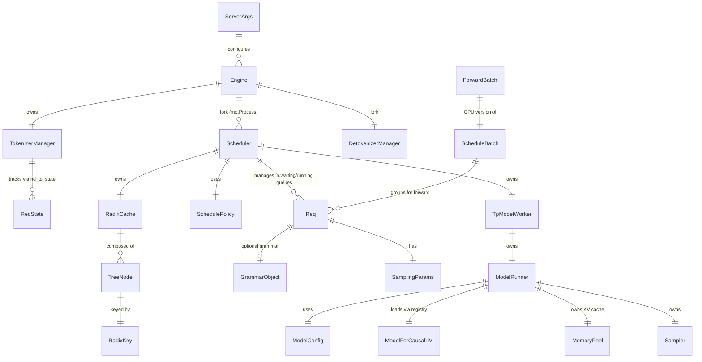
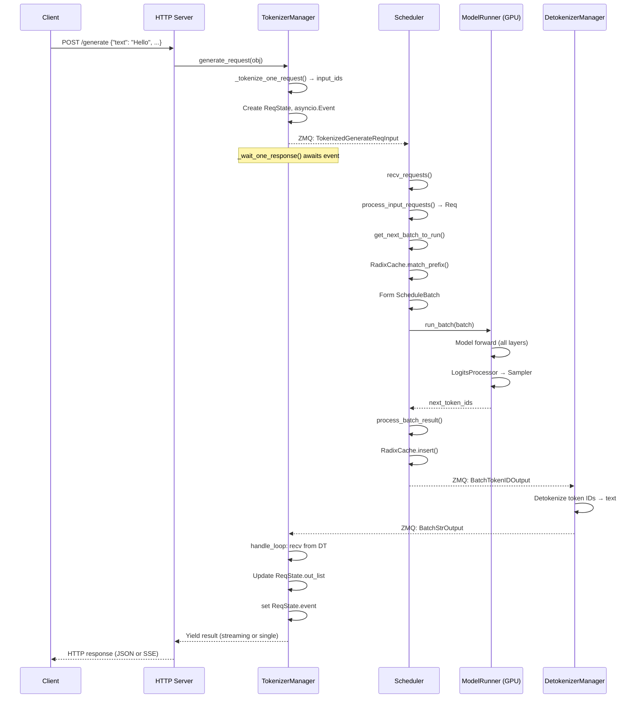

# Data Model, State And Flow

## 1. Data Definition Sources

| Source Type | Path | Main Models | Evidence |
|---|---|---|---|
| **Request/Response DTOs** | managers/io_struct.py | GenerateReqInput, EmbeddingReqInput, TokenizedGenerateReqInput, BatchStrOutput, etc. | io_struct.py (defines all IPC message types) |
| **Request State** | managers/schedule_batch.py | Req (578), ScheduleBatch (1381) | Central request lifecycle objects |
| **Forward Batch** | model_executor/forward_batch_info.py | ForwardBatch, ForwardMode, PPProxyTensors | GPU-side batch metadata |
| **Configuration** | server_args.py, configs/model_config.py | ServerArgs, ModelConfig, DeviceConfig | Configuration data models |
| **Sampling** | sampling/sampling_batch_info.py | SamplingBatchInfo, SamplingParams | Sampling configuration |
| **IPC Wire Format** | managers/io_struct.py | All *ReqInput, *ReqOutput classes | ZMQ message serialization |
| **KV Cache** | mem_cache/memory_pool.py, radix_cache.py | ReqToTokenPool, MHATokenToKVPool, RadixCache, TreeNode | Memory management data |
| **Speculative** | speculative/eagle_info.py, spec_info.py | EagleVerifyInput, SpecInput, DraftOutput | Spec decoding data |
| **LoRA** | lora/lora.py, lora/lora_manager.py | LoRAAdapter, LoRAConfig | Adapter data |

## 2. Core Data Models

### 2.1 Request Lifecycle Objects

#### GenerateReqInput (io_struct.py)
```python
# Client-facing request structure
class GenerateReqInput:
    text: str | List[str]             # Input prompt
    input_ids: List[int] | List[List[int]]
    sampling_params: Dict             # temperature, top_p, max_new_tokens, etc.
    rid: str | List[str]              # Request ID
    stream: bool                      # Streaming response
    return_logprob: bool
    json_schema: str                  # Structured output
    regex: str
    lora_path: str | List[str]        # LoRA adapter
    priority: int                     # Priority scheduling
    # ... more fields
```

#### TokenizedGenerateReqInput (io_struct.py)
```python
# What the TokenizerManager sends to the Scheduler via ZMQ
class TokenizedGenerateReqInput:
    rid: str
    input_ids: List[int]              # Tokenized input
    sampling_params: SamplingParams
    image_inputs: Optional[MultimodalInputs]
    lora_id: Optional[int]
    json_schema: Optional[str]
    regex: Optional[str]
    # ... serialized for ZMQ transport
```

#### Req (schedule_batch.py:578)
```python
# The central request state object during scheduling
class Req:
    rid: str                          # Unique request ID
    origin_input_ids: List[int]       # Original prompt tokens
    output_ids: List[int]             # Accumulated generated tokens
    fill_ids: List[int]               # = origin_input_ids + output_ids (for KV cache)
    prefix_indices: torch.Tensor      # KV cache indices for shared prefix
    extend_input_len: int             # New tokens to prefill this round
    kv_committed_len: int             # Committed KV cache length
    kv_allocated_len: int             # Allocated KV cache length
    req_pool_idx: int                 # Index in req_to_token pool
    max_new_tokens: int
    sampling_params: SamplingParams
    finished_reason: Optional[FinishReason]
    priority: int
    lora_id: Optional[int]
    grammar: Optional[BaseGrammarObject]
    last_node: TreeNode               # Radix tree node reference
    # ... extensive state
```

#### ScheduleBatch (schedule_batch.py:1381)
```python
class ScheduleBatch:
    reqs: List[Req]
    forward_mode: ForwardMode         # EXTEND or DECODE
    input_ids: torch.Tensor           # [total_tokens]
    req_pool_indices: torch.Tensor    # [bs]
    seq_lens: torch.Tensor            # [bs]
    out_cache_loc: torch.Tensor       # [bs]
    output_ids: torch.Tensor          # [bs] — generated token IDs
    prefix_lens: torch.Tensor         # [bs] — lengths of cached prefix
    extend_lens: torch.Tensor         # [bs] — lengths to prefill
    sampling_info: SamplingBatchInfo
    spec_algorithm: SpeculativeAlgorithm
    has_grammar: bool
    # ... GPU tensors for batch execution
```

### 2.2 Model Execution Objects

#### ForwardBatch (forward_batch_info.py)
```python
class ForwardBatch:
    forward_mode: ForwardMode         # EXTEND, DECODE, TARGET_VERIFY, etc.
    input_ids: torch.Tensor
    positions: torch.Tensor           # Position IDs for RoPE
    req_pool_indices: torch.Tensor
    seq_lens: torch.Tensor
    extend_seq_lens: torch.Tensor
    prefix_lens: torch.Tensor
    attn_backend: AttentionBackend    # Selected attention runtime
    # ... GPU-native tensors for model forward
```

#### ModelConfig (configs/model_config.py)
```python
class ModelConfig:
    model_path: str
    model_impl: ModelImpl             # AUTO, SGLANG, TRANSFORMERS, MINDSPORE
    attention_arch: AttentionArch     # MHA, MLA, NSA, LINEAR, etc.
    hf_config: PretrainedConfig       # HuggingFace config
    num_hidden_layers: int
    num_attention_heads: int
    num_key_value_heads: int
    hidden_size: int
    vocab_size: int
    max_context_len: int
    dtype: torch.dtype
    quantization_config: Optional[QuantizationConfig]
    # ... full model architecture description
```

### 2.3 IPC Wire Format

| Message | Direction | Contents | Evidence |
|---|---|---|---|
| `TokenizedGenerateReqInput` | TokenizerManager → Scheduler | Tokenized prompt, sampling params, multimodal data | io_struct.py |
| `BatchTokenIDOutput` | Scheduler → DetokenizerManager | Per-request token IDs, finish flags, logprobs | io_struct.py |
| `BatchStrOutput` | DetokenizerManager → TokenizerManager | Detokenized text, finish reason | io_struct.py |
| `AbortReq` | TokenizerManager → Scheduler | Request IDs to abort | io_struct.py |
| `FlushCacheReqInput` | TokenizerManager → Scheduler | Cache flush command | io_struct.py |
| `UpdateWeightFromDiskReqInput` | TokenizerManager → Scheduler | Hot-reload weight command | io_struct.py |
| `RpcReqInput` / `RpcReqOutput` | TokenizerManager → Scheduler | Generic RPC commands | io_struct.py |

### 2.4 Memory Management Data

| Data Structure | File | Shape/Content | Purpose |
|---|---|---|---|
| `ReqToTokenPool` | memory_pool.py:128 | `[max_requests, max_context_len]` | Maps request index → token's KV cache locations |
| `MHATokenToKVPool` | memory_pool.py | `k_cache: [max_tokens, num_kv_heads, head_dim]`, `v_cache: [max_tokens, num_kv_heads, head_dim]` | MHA KV cache storage |
| `MLATokenToKVPool` | memory_pool.py | `kv_cache: [max_tokens, kv_lora_rank]` | MLA low-rank KV cache |
| `RadixCache(TreeNode)` | radix_cache.py | Trie of token sequences → KV indices | Prefix caching |
| `PageAllocator` | allocator.py | Free page bitmap | Page-based KV cache allocation |

## 3. ER Diagram



## 4. Data Lifecycle

| Stage | Data Shape | File/Symbol | Transformation | Risk |
|---|---|---|---|---|
| **Client sends** | `GenerateReqInput(text, sampling_params, ...)` | io_struct.py | Client → HTTP request body | Input validation at API boundary |
| **Tokenize** | `TokenizedGenerateReqInput(input_ids, ...)` | tokenizer_manager.py `_tokenize_one_request()` | Text → Integer token IDs via HF tokenizer | Tokenizer OOM, bad encoding |
| **Enqueue** | `Req(rid, origin_input_ids, ...)` | scheduler.py `process_input_requests()` | Tokenized request → Req object | Queue overflow |
| **Schedule** | `ScheduleBatch(reqs, input_ids, prefix_indices, ...)` | scheduler.py `get_next_batch_to_run()` | Multiple Reqs merged; prefix matched via RadixCache | Prefix mismatch, budget exceeded |
| **Forward** | `ForwardBatch(input_ids, positions, ...)` | model_runner.py `forward()` | ScheduleBatch → GPU tensors; model forward pass | CUDA OOM, NaN logits |
| **Sample** | `next_token_ids: [bs]` | sampler.py `Sampler.forward()` | Logits → Token ID via sampling strategy | Degenerate output, grammar violation |
| **Cache update** | `RadixCache.insert(key, value)` | radix_cache.py | New token → KV cache indices stored in radix tree | Memory exhaustion |
| **Detokenize** | `BatchStrOutput(texts, ...)` | detokenizer_manager.py | Token IDs → Human-readable text | Bad UTF-8, incomplete sequences |
| **Stream to client** | SSE events or JSON response | tokenizer_manager.py `handle_loop()` | Detokenized text → HTTP response chunks | Client disconnected |

### Data Input Validation Points
1. `GenerateReqInput.normalize_batch_and_arguments()` — validates text, sampling params
2. Tokenizer checks — max context length, special token handling
3. `GrammarManager.process_req_with_grammar()` — validates JSON schema/regex
4. `Sampler` — clips temperature, validates top-k/top-p ranges

### Data Error Handling Points
1. Tokenizer errors → caught in `_tokenize_one_request()`, returned as error response
2. Invalid sampling params → `SamplingParams.__post_init__()` raises ValueError
3. OOM during forward → `ModelRunner.forward()` raises, caught by scheduler
4. Grammar compilation failure → `GrammarManager` returns `InvalidGrammarObject`
5. Detokenization errors → token ignored, logged

## 5. Request / Response Flow



## 6. Async / Event / Queue Flow

### ZMQ IPC Queues (Token → Scheduler → Detokenizer pipeline)

```
[TokenizerManager] ───ZMQ_PUSH───▶ [Scheduler] ───ZMQ_PUSH───▶ [DetokenizerManager]
        ▲                                                              │
        └──────────────────ZMQ_PULL────────────────────────────────────┘
```

### Scheduler Internal Queues
```
Waiting Queue (List[Req])
    ↓ SchedulePolicy.calc_priority()
    ↓ PrefillAdder.add_one_req()
Running Batch (ScheduleBatch)
    ↓ ModelRunner.forward()
    ↓ process_batch_result() → Finished requests removed
    ↓ merge_batch() → Prefill reqs → Running batch
```

### Grammar Compilation (Async via ThreadPoolExecutor)
```
GrammarManager.process_req_with_grammar()
    → If cache hit: return immediately
    → If cache miss: submit_to_threadpool(BaseGrammarBackend.dispatch_*)
        → Future stored in grammar_queue
    → get_ready_grammar_requests(): poll Futures, all_gather_object for DP consensus
```

### Speculative Decoding Overlap Queue
```
result_queue: Deque[Tuple[ScheduleBatch, GenerationBatchResult]]
    ← pop_and_process(): process previous batch's results
    ← push(batch, result): queue current batch for deferred processing
```

## 7. Cache And Storage Flow

### KV Cache Hierarchy
```
Layer 1: GPU Memory (HBM)
├── ReqToTokenPool: [max_requests × max_tokens] indices → KV locations
├── TokenToKVPool: k_cache [total_tokens × heads × dim] + v_cache [total_tokens × heads × dim]
└── RadixCache (Trie in CPU memory): token_sequence → KV indices

Layer 2: Host Memory (CPU RAM) — Optional
├── Hierarchical Cache (HiCache): KV pages swapped from GPU → CPU RAM
└── Storage backends: Redis, S3, local disk

Layer 3: Network Transfer — Disaggregation
├── Mooncake RDMA: GPU → GPU KV transfer
└── Connector: Redis/S3/Azure for model weights and KV state
```

### Cache Eviction
```
RadixCache:
├── LRU: Least Recently Used (default)
├── LFU: Least Frequently Used
├── FIFO: First In First Out
├── Priority-aware: evict low-priority requests first
└── Lock-based protection: inc_lock_ref() prevents eviction during use
```

## 8. State Management

| State Type | Location | Mutation Pattern | Owner | Risk |
|---|---|---|---|---|
| **Request State** | tokenizer_manager.py `rid_to_state: Dict[str, ReqState]` | Created on request arrival, updated on each chunk, deleted on completion | TokenizerManager | Memory leak if requests never complete |
| **Schedule State** | scheduler.py `waiting_queue: List[Req]`, `running_batch: ScheduleBatch` | Requests added via recv, removed on completion/preemption | Scheduler | Queue backlog under load |
| **KV Cache State** | mem_cache/memory_pool.py, radix_cache.py | Written by attention during forward, evicted by cache policy | Scheduler / ModelRunner | Memory fragmentation, OOM |
| **Model Weights** | GPU memory (HBM) | Loaded once at startup, hot-reloaded via `update_weights_from_tensor()` | ModelRunner | Weight corruption on failed update |
| **Grammar State** | per-request `BaseGrammarObject` | `accept_token()` advances state, `rollback()` for spec decoding rollback | GrammarManager | State desync with tokens |
| **Session State** | session/ `SessionSlot`, `SessionController` | KV cache preserved across multi-turn sessions | SessionController | Session slot exhaustion |
| **Global Config** | `_GlobalState` singleton (http_server.py:190) | Set once at startup | HTTP Server | Implicit coupling (anti-pattern) |

## 9. Data Security And Privacy

| Risk | Evidence | Impact | Mitigation |
|---|---|---|---|
| **Prompt data in plaintext** across ZMQ IPC | io_struct.py: request text sent as plain Python objects | Low (local IPC, same node) | Use Unix domain sockets, restrict to localhost |
| **KV cache contains user prompts** | memory_pool.py: KV tensors in GPU memory | Medium (other GPU processes may read) | GPU memory isolation (CUDA MPS) |
| **Logging may contain PII** | tokenizer_manager.py logs request contents at DEBUG level | Low (configurable log level) | Set log level ≥ INFO in production |
| **No built-in auth** | http_server.py: routes have no authentication middleware | High (if exposed to network) | Use network-level auth (API gateway, firewall) |
| **Model weights serialized** via ZMQ for updates | engine.py: `UpdateWeightsFromTensorReqInput` | Medium (unencrypted weight transfer) | Restrict IPC to localhost |
| **No request-level encryption** | All HTTP requests handled plaintext by default | Low (TLS terminates at reverse proxy) | Use TLS termination at load balancer |

## 10. Data Flow Verdict

SGLang's data model is **IPC-centric and stream-oriented**: requests flow through a ZMQ pipeline where each stage transforms the data shape (text → tokens → Req → batch → logits → tokens → text). The system prioritizes **throughput over latency isolation**: requests share KV cache space and GPU memory, with eviction policies resolving contention. The data model is **strongly typed** via dataclasses but **weakly validated at IPC boundaries** — ZMQ serialization trusts the producer. For production use, network-level security (firewall, TLS termination) is required since the system provides no built-in authentication or encryption.
