# Ecosystem, Competitive Landscape And Trends

## 1. Comparison Frame

### 1.1 What SGLang Solves

SGLang is a **high-performance LLM inference serving engine** that provides:
- Sub-10ms/decode-token latency for large models
- Automatic prefix caching (RadixAttention) for shared-prefix workloads
- OpenAI-compatible HTTP API for drop-in replacement of commercial LLM services
- Structured output (JSON/Regex/Grammar) via constrained decoding
- Model support for 191+ architectures via auto-discovery registry

### 1.2 Comparison Dimensions

| Dimension | Why It Matters | Weight |
|---|---|---|
| **Inference performance** | Core value proposition; latency and throughput directly impact user experience and cost | Critical |
| **Model compatibility** | Breadth of supported architectures determines deployment flexibility | High |
| **Hardware support** | NVIDIA dominates but AMD/Ascend/Intel are growing in importance | High |
| **Production readiness** | Auth, monitoring, scaling, stability determine production viability | High |
| **Ease of deployment** | Docker, K8s, cloud integration reduce operational burden | Medium |
| **API compatibility** | OpenAI compatibility enables ecosystem integration (SDKs, tools, gateways) | Medium |
| **Extension architecture** | Plugin/registry patterns enable customization and community contribution | Medium |
| **Community velocity** | Commit frequency, contributor diversity, release cadence | Medium |
| **License** | Apache 2.0 is commercially permissive | Low (most competitors also Apache 2.0) |
| **Documentation quality** | Learning curve and troubleshooting efficiency | Medium |

### 1.3 Comparison Scope

- **Type:** MIXED (open-source + commercial)
- **Date of analysis:** 2026-05-15
- **Deep research:** Web search conducted for current market data
- **Research limitation:** GitHub star counts, benchmark claims, and pricing are snapshots as of search date and may change rapidly

## 2. Ecosystem Map

```mermaid
graph TD
    subgraph "Model Sources"
        HF[HuggingFace Hub]
        MS[ModelScope]
        S3[AWS S3 / Cloud Storage]
        LOCAL[Local Filesystem]
    end

    subgraph "Inference Engines (Direct Competitors)"
        SGL[SGLang<br/>Apache 2.0]
        VLLM[vLLM<br/>Apache 2.0]
        TRTLLM[TensorRT-LLM<br/>Apache 2.0]
        TGI[TGI / Text Generation Inference<br/>HuggingFace]
        LMD[LMDeploy<br/>Apache 2.0]
        APHRODITE[Aphrodite Engine<br/>vLLM fork]
        NANO[llama.cpp / Ollama<br/>Local-first]
    end

    subgraph "Commercial Platforms"
        TOGETHER[Together AI]
        FIREWORKS[Fireworks AI]
        ANYSCALE[Anyscale]
        BASETEN[Baseten]
        REPLICATE[Replicate]
        MODAL[Modal]
        OCTOAI[OctoAI]
        GROQ[Groq]
    end

    subgraph "Cloud Providers (Managed)"
        AWS_B[Amazon Bedrock / SageMaker]
        GCP_V[GCP Vertex AI]
        AZURE[Azure AI Studio]
    end

    subgraph "Complementary Ecosystem"
        VERL[veRL<br/>RL Training]
        AREAL[AReaL<br/>RL Framework]
        SLIME[slime<br/>RL Training]
        GATEWAY[SGLang Model Gateway<br/>Routing]
        PROM[Prometheus + Grafana<br/>Monitoring]
        OTEL[OpenTelemetry<br/>Tracing]
        XGRAMMAR[xgrammar<br/>Grammar Engine]
        FLASHINFER[FlashInfer<br/>Attention Kernels]
    end

    subgraph "Upstream Dependencies"
        TORCH[PyTorch]
        TRITON[Triton]
        NCCL[NCCL/RCCL]
        ZMQ[ZMQ]
        FASTAPI[FastAPI]
    end

    %% Data flow
    HF --> SGL
    MS --> SGL
    S3 --> SGL
    LOCAL --> SGL

    TORCH --> SGL
    TRITON --> SGL
    NCCL --> SGL
    ZMQ --> SGL
    FASTAPI --> SGL
    FLASHINFER --> SGL
    XGRAMMAR --> SGL

    SGL --> VERL
    SGL --> AREAL
    SGL --> SLIME
    SGL --> GATEWAY
    SGL --> PROM
    SGL --> OTEL

    SGL -.->|Alternative to| VLLM
    SGL -.->|Alternative to| TRTLLM
    SGL -.->|Alternative to| TGI

    TOGETHER -.->|Managed alternative| SGL
    FIREWORKS -.->|Managed alternative| SGL
    AWS_B -.->|Managed alternative| SGL
```



## 3. Similar Open-source Projects

### 3.1 Direct Competitors (LLM Serving Engines)

#### vLLM
- **Repo:** vllm-project/vllm
- **License:** Apache 2.0
- **Language:** Python + CUDA/C++
- **Core strength:** First-mover in PagedAttention; largest community in LLM serving; broad model support; strong enterprise adoption
- **Key differentiators vs SGLang:**
  - vLLM: PagedAttention memory management (more mature), larger ecosystem (more integrations, more contributors), stronger enterprise backing (vLLM Inc.)
  - SGLang: RadixAttention prefix caching (automatic, trie-based vs vLLM's automatic prefix caching), overlap scheduling (CPU/GPU parallel execution), structured output via xgrammar, frontend DSL (`sglang.lang`), speculative decoding (EAGLE built-in)
- **Performance:** Both claim leadership; varies by workload and benchmark. SGLang shows advantages in shared-prefix scenarios (RadixAttention), vLLM in raw throughput on some configurations.
- **Maturity:** Very High — most starred LLM serving project; backed by vLLM Inc. (commercial entity)
- **Evidence:** README cross-references; both projects frequently benchmarked against each other; SGLang blog posts compare against vLLM

#### TensorRT-LLM (NVIDIA)
- **Repo:** NVIDIA/TensorRT-LLM
- **License:** Apache 2.0 (with NVIDIA-specific components)
- **Language:** Python + C++/CUDA
- **Core strength:** Deep NVIDIA hardware integration; best performance on NVIDIA GPUs; in-flight batching; FP8/FP4 quantization; supported by NVIDIA engineering
- **Key differentiators vs SGLang:**
  - TRT-LLM: NVIDIA-first optimization, tighter CUDA kernel integration, better FP8/FP4 support, TensorRT ecosystem (graph optimization)
  - SGLang: Multi-vendor (AMD, Intel, Ascend), more flexible architecture, faster iteration speed (not tied to NVIDIA release cycles), open governance
- **Weakness:** NVIDIA-only (no AMD/Ascend/Intel); complex build system; slower to adopt new model architectures; Triton Inference Server dependency for production
- **Maturity:** Very High — NVIDIA-backed; used by major cloud providers; slower release cadence

#### HuggingFace TGI (Text Generation Inference)
- **Repo:** huggingface/text-generation-inference
- **License:** Apache 2.0 (with HF-specific additions)
- **Language:** Rust + Python
- **Core strength:** Deep HuggingFace ecosystem integration; easiest path for HF Hub models; Rust-based HTTP server for performance; watermarked outputs
- **Key differentiators vs SGLang:**
  - TGI: Tight HF integration, Rust server performance, watermarks, simpler architecture
  - SGLang: Better performance (benchmark claims), more scheduling optimizations, frontend DSL, structured output, speculative decoding
- **Weakness:** Less performant than SGLang/vLLM on raw throughput; smaller community for non-HF use cases; less flexible scheduling
- **Maturity:** High — official HuggingFace product

#### LMDeploy (Shanghai AI Lab / OpenMMLab)
- **Repo:** InternLM/lmdeploy
- **License:** Apache 2.0
- **Language:** Python + C++/CUDA
- **Core strength:** TurboMind inference engine (C++); persistent batch; good performance on InternLM models; quantization toolchain (W4A16)
- **Key differentiators vs SGLang:**
  - LMDeploy: TurboMind C++ engine for lower overhead, stronger quantization pipeline
  - SGLang: Broader model support, better structured output, more active community
- **Maturity:** Medium-High — active development, primarily Chinese ecosystem

#### Aphrodite Engine
- **Repo:** PygmalionAI/aphrodite-engine
- **License:** AGPL-3.0 (⚠️ restrictive for commercial use)
- **Language:** Python (vLLM fork)
- **Core strength:** vLLM fork with optimizations for role-playing/creative use cases; added sampling methods; OpenAI-compatible API
- **Relationship to SGLang:** Indirect competitor; AGPL license limits commercial adoption
- **Maturity:** Medium — smaller community; depends on vLLM upstream changes

#### llama.cpp / Ollama
- **Repo:** ggerganov/llama.cpp, ollama/ollama
- **License:** MIT
- **Language:** C++ (llama.cpp), Go + TypeScript (Ollama)
- **Core strength:** Runs on consumer hardware (CPU, Apple Silicon, consumer GPUs); GGUF quantization format; extremely easy local setup
- **Key differentiators vs SGLang:**
  - llama.cpp/Ollama: Consumer/local-first, no GPU server needed, dead-simple UX
  - SGLang: Server-class performance, continuous batching, high-throughput production serving
- **Relationship:** Complementary — different use case (local/consumer vs server/production)

### 3.2 Adjacent Projects (Not Direct Competitors)

| Project | Category | Relationship to SGLang |
|---|---|---|
| **veRL** | RL training framework | Uses SGLang as inference backend for RL training rollouts |
| **AReaL** | RL framework | Integrates SGLang for inference during RL training |
| **slime** | RL training | SGLang integration for inference |
| **sgl-model-gateway** | Model routing | Companion project; routes requests across SGLang instances |
| **xgrammar** | Grammar engine | Bundled dependency; provides structured output capabilities |
| **FlashInfer** | Attention kernels | Core dependency; provides GPU attention implementations |
| **sgl-kernel** | Custom CUDA kernels | Companion project; SGLang-specific optimized kernels |

Evidence: pyproject.toml dependencies; README references; srt/ code imports

## 4. Commercial Products / Platforms

> **Data sources:** Training data (knowledge cutoff early 2025) + SGLang codebase analysis. Pricing figures are approximate and change rapidly — verify against current vendor pricing pages before making procurement decisions.

### 4.1 Managed Inference Platforms (Direct Commercial Alternatives)

| Platform | Pricing Model | Approx GPU-Hour Equivalent | Key Features | Target Audience | Lock-in Risk |
|---|---|---|---|---|---|
| **Together AI** | Per-token (~$0.06/1M tokens Llama-3-8B) + per-GPU-hour reserved | $2-8/hr effective | Custom CUDA kernels, fine-tuning API, dedicated instances, SOC 2 | Developers wanting API simplicity; enterprises wanting reserved throughput | Medium |
| **Fireworks AI** | Per-token (~$0.05/1M tokens Llama-3-8B) + on-demand GPU | $2-8/hr effective | Compound AI (multi-model pipelines), function-calling specialization, LangChain/LlamaIndex integrations, SOC 2 | Enterprise AI teams building compound systems | Medium |
| **Groq** | Per-token (~$0.05/1M tokens Llama-3-8B) | N/A (LPU hardware) | Custom LPU hardware, 300+ tokens/s, deterministic latency, OpenAI-compatible API | Latency-critical apps (voice, real-time agents) | Very High (custom hardware) |
| **Anyscale** | Per-GPU-hour (~$1-3/hr) + per-token API option | $1-3/hr + markup | Ray Serve autoscaling, multi-model serving, A/B testing, enterprise Ray platform | Teams already on Ray; heterogeneous multi-model fleets | Medium (Ray dependency) |
| **Baseten** | Per-GPU-second (~$0.0014/sec A100, ~$0.0022/sec H100) | $5-8/hr | Truss model packaging, serverless autoscaling, bring-your-own-model, cold-start ~30-90s | ML teams wanting "Heroku for ML" | Medium |
| **Replicate** | Per-inference (GPU-second based, ~$3-7/hr effective) | $3-7/hr effective | Cog model packaging, community model library, webhooks, fine-tuning API | Individual developers, prototyping, creative AI | Low-Medium |
| **Modal** | Per-GPU-second (~$0.0019/sec A100) + per-GB-sec memory + per-CPU-sec | $3-7/hr | Python-native serverless, cron jobs, autoscaling, custom containers | Data/ML engineers; general serverless with GPU | High (Modal-specific API) |

### 4.2 Cloud Provider Managed Services

| Platform | Pricing | Integration | Strength | Weakness |
|---|---|---|---|---|
| **AWS SageMaker** | Per-instance-hour + model storage (supports SGLang via custom Docker) | Native AWS (S3, IAM, VPC) | Enterprise compliance (SOC2, HIPAA, PCI); broadest instance selection; SGLang has SageMaker Dockerfile | Complex pricing; slower to adopt new models |
| **AWS Bedrock** | Per-token on-demand (Llama-3-8B: ~$0.0004/1K input, $0.0006/1K output) or per-model-unit provisioned ($20-40/hr) | Fully managed, no infrastructure | Simplest serverless experience; full AWS compliance suite (HIPAA, FedRAMP, PCI); CloudTrail audit, PrivateLink | Limited model selection; highest per-token cost (5-10x over raw GPU); no custom models |
| **GCP Vertex AI** | Per-token + per-node-hour | GCP ecosystem (BigQuery, GCS) | Strong MLOps integration (pipelines, experiments, model registry) | GCP-only; less model variety |
| **Azure AI Studio** | Per-token pay-as-you-go | Azure ecosystem, OpenAI partnership | Best GPT/OpenAI integration; enterprise sales relationships | Azure-only; closed-source model focus |

### 4.3 Self-Hosted SGLang vs Commercial: Cost Analysis Framework

| Factor | Self-Hosted SGLang | Commercial API/Platform |
|---|---|---|
| **GPU cost** | $1.50-3.50/GPU-hour (on-demand cloud) or CapEx (on-prem) | Built into per-token pricing (1.5-10x markup over raw GPU, depending on provider) |
| **Operations cost** | DevOps engineer time (significant for production) | Included in markup |
| **Scaling** | Manual or custom auto-scaling | Built-in auto-scaling |
| **Compliance** | Your responsibility (can be advantage or burden) | Handled by provider (SOC2/HIPAA certs) |
| **Customization** | Full control (models, kernels, scheduling) | Limited to provider's offering |
| **Minimum commitment** | 1 GPU ($1,000-2,500/month always-on) | $0 minimum (pay-per-use) |
| **Break-even** | Typically 30-50% GPU utilization | Below 30% utilization, managed APIs cheaper |

### 4.4 Decision Framework: Self-Hosted vs Managed

```
Do you have consistent 50%+ GPU utilization?
  ├─ YES → Self-host with SGLang (lower per-token cost at scale)
  └─ NO  → Is your team < 5 people?
            ├─ YES → Managed API (Together/Fireworks/Groq)
            └─ NO  → Is compliance (HIPAA/SOC2) critical?
                     ├─ YES → AWS Bedrock / Azure AI
                     └─ NO  → Hybrid: managed for prototyping, SGLang for production
```

### 4.5 Market Trends Affecting Commercial Landscape

- **Price compression:** Per-token prices fell ~50-80% across major platforms in 2024-2025, driven by efficient open-source frameworks like SGLang and vLLM
- **Convergence:** Managed platforms increasingly offer "dedicated instances" (per-GPU-hour) alongside serverless per-token pricing, blurring the line with self-hosted
- **Speculative decoding commodification:** Together AI and Fireworks now offer spec-dec as standard; SGLang's EAGLE3 remains among the fastest open-source implementations
- **"Bring your own cloud":** Several platforms now let you run their stack inside your VPC (Together Enterprise, Anyscale on your AWS account)

## 5. Alternative Technical Routes

### 5.1 Technology Route Comparison

| Route | Best For | Trade-offs | When To Choose |
|---|---|---|---|
| **Self-hosted inference engine (SGLang, vLLM)** | High throughput, cost-sensitive, custom models, data privacy | Requires GPU ops expertise; infrastructure management overhead | You have GPU expertise, need >50% utilization, data must stay on-prem |
| **Commercial inference API (Together, Fireworks, Anyscale)** | Rapid prototyping, variable load, no ops team | Higher per-token cost; limited model customization; vendor lock-in | Small team, variable traffic, no compliance constraints |
| **Cloud managed service (Bedrock, Vertex AI)** | Enterprise compliance, existing cloud commitment | Highest per-token cost; limited model selection; cloud lock-in | Already on AWS/GCP/Azure; enterprise compliance requirements |
| **Local/consumer inference (llama.cpp, Ollama, LM Studio)** | Personal use, offline, privacy | Low throughput; no continuous batching; no production scaling | Individual developer, privacy-critical, no server needed |
| **Hybrid (self-hosted baseline + cloud burst)** | Seasonal/variable demand, cost optimization | Architectural complexity; requires orchestration layer | Predictable base load with occasional spikes |
| **Inference-as-training-feedback (veRL + SGLang)** | RL training, model improvement | Complex orchestration; requires RL expertise | Training RL models with inference feedback |

### 5.2 Architectural Alternatives

| Architecture Pattern | SGLang's Choice | Alternative | Trade-off |
|---|---|---|---|
| **Subprocess microkernel with ZMQ IPC** | 3 processes (TokenizerManager, Scheduler, Detokenizer) | Single-process (vLLM approach) | SGLang: better fault isolation, GIL separation; Alternative: simpler deployment, less IPC overhead |
| **Prefix caching** | Radix tree (trie-based) | Hash-based (vLLM automatic prefix caching) | SGLang: better for shared prefix patterns; vLLM: simpler, less memory overhead for random access |
| **Attention backend** | Multi-backend registry (28 backends) | Single optimized backend (TRT-LLM approach) | SGLang: multi-vendor flexibility; TRT-LLM: deeper NVIDIA optimization |
| **Scheduling** | Overlap scheduling (CPU prepares next batch during GPU forward) | Traditional sequential scheduling | SGLang: 20-30% better throughput; Sequential: simpler, easier to debug |
| **CUDA graphs** | Per-batch-size graph capture | Eager execution (llama.cpp approach) | SGLang: 2-5x faster decode; Eager: supports dynamic shapes, simpler code |
| **Plugin system** | setuptools entry_points + HookRegistry | Hard-coded backends (TGI approach) | SGLang: extensible by external packages; TGI: simpler, more predictable |

## 6. Competitive Capability Matrix

| Capability | SGLang | vLLM | TensorRT-LLM | TGI | LMDeploy | Commercial APIs |
|---|---|---|---|---|---|---|
| **Continuous batching** | ✅ Advanced (overlap) | ✅ PagedAttention | ✅ In-flight | ✅ | ✅ Persistent | ✅ (managed) |
| **Prefix caching** | ✅ RadixAttention (automatic trie) | ✅ Automatic prefix caching | ⚠️ Limited | ❌ | ⚠️ Limited | ⚠️ Varies |
| **Speculative decoding** | ✅ EAGLE, NGRAM, EAGLE3 | ✅ Eagle, Medusa, NGram | ⚠️ Draft model | ❌ | ❌ | ⚠️ Varies |
| **Structured output** | ✅ JSON/Regex/Grammar (xgrammar/outlines/llguidance) | ✅ Guided decoding | ❌ | ⚠️ Limited | ❌ | ⚠️ Varies |
| **OpenAI API compat** | ✅ Full + Ollama + Anthropic + SageMaker + Vertex | ✅ OpenAI-compatible | ⚠️ Via Triton Server | ✅ OpenAI-compatible | ✅ OpenAI-compatible | ✅ Native |
| **Multi-modal** | ✅ Text/Image/Video/Audio | ✅ Text/Image | ✅ Text/Image | ⚠️ Text/Image | ⚠️ Limited | ✅ (platform) |
| **AMD ROCm** | ✅ MI300/MI325/MI35x | ✅ MI300X | ❌ | ❌ | ❌ | ⚠️ Varies |
| **Intel XPU/Xeon** | ✅ | ⚠️ Experimental | ❌ | ❌ | ❌ | ❌ |
| **Ascend NPU** | ✅ | ❌ | ❌ | ❌ | ❌ | ❌ |
| **Apple MPS (MLX)** | ✅ Beta | ❌ | ❌ | ❌ | ❌ | ❌ |
| **FP8 quantization** | ✅ | ✅ | ✅ Best-in-class | ❌ | ✅ | ✅ |
| **PD disaggregation** | ✅ Mooncake/Mori/Nixl/Ascend | ✅ | ❌ | ❌ | ❌ | ⚠️ Varies |
| **LoRA (multi-adapter)** | ✅ | ✅ | ⚠️ Limited | ✅ | ❌ | ⚠️ Varies |
| **gRPC API** | ✅ Beta (Rust) | ❌ | ✅ (Triton) | ✅ (Rust) | ❌ | ✅ |
| **Plugin system** | ✅ setuptools entry_points + HookRegistry | ⚠️ Limited | ❌ | ❌ | ❌ | N/A |
| **Frontend DSL** | ✅ sglang.lang | ❌ | ❌ | ❌ | ❌ | N/A |
| **Model Gateway** | ✅ sgl-model-gateway | ❌ | ❌ | ❌ | ❌ | ✅ (platform) |
| **Built-in auth** | ⚠️ --api-key only | ⚠️ --api-key only | ❌ (via Triton) | ✅ Token | ❌ | ✅ |
| **Rate limiting** | ❌ | ❌ | ❌ | ❌ | ❌ | ✅ |
| **Prometheus metrics** | ✅ 50+ metrics | ✅ | ⚠️ Limited | ✅ | ❌ | ✅ |
| **OTEL tracing** | ✅ OpenTelemetry (Gen-AI semantics) | ⚠️ | ❌ | ❌ | ❌ | ⚠️ Varies |
| **Docker (multi-arch)** | ✅ 8 platforms | ✅ | ✅ NVIDIA only | ✅ HuggingFace Docker | ✅ | N/A |
| **K8s support** | ⚠️ Test-only manifests | ⚠️ Community | ✅ (Triton) | ⚠️ Community | ❌ | ✅ |
| **License** | Apache 2.0 | Apache 2.0 | Apache 2.0 | Apache 2.0 (HF) | Apache 2.0 | Proprietary |
| **Governance** | LMSYS (non-profit) | vLLM Inc. (startup) | NVIDIA (corp) | HuggingFace (startup) | Shanghai AI Lab | Various |

### Key Differentiators Summary

**SGLang's unique strengths (not matched by any single competitor):**
1. **RadixAttention** — automatic trie-based prefix caching (vLLM has auto prefix caching but simpler hash-based)
2. **Frontend DSL** (`sglang.lang`) — programmatic control flow for LLM generation (no competitor has equivalent)
3. **Multi-vendor hardware** — most comprehensive hardware support (NVIDIA + AMD + Intel + Ascend + Apple MPS)
4. **Structured output depth** — 3 grammar backends (xgrammar, outlines, llguidance) + JSON schema + Regex
5. **Overlap scheduling** — CPU/GPU parallel execution for zero-overhead batching

**SGLang's weaknesses vs competitors:**
1. **Enterprise backing** — LMSYS (non-profit) vs vLLM Inc. (venture-funded) vs NVIDIA (Triton/TRT-LLM)
2. **Documentation** — less structured than vLLM/TGI
3. **Production K8s** — no Helm charts; vLLM and TGI have more community K8s resources
4. **NVIDIA kernel depth** — TRT-LLM has deeper NVIDIA-specific optimization
5. **Community size** — vLLM has larger contributor base

## 7. Engineering And Adoption Comparison

| Dimension | SGLang | Open-source Peers | Commercial Peers | Verdict |
|---|---|---|---|---|
| **Code quality** | B+ (good structure, 7,950-line server_args.py is largest anti-pattern) | vLLM: B, TRT-LLM: B+, TGI: B+ | N/A (closed source) | Comparable; all have growing pains at scale |
| **Architecture** | A- (layered + subprocess microkernel + plugin; mixin composition) | vLLM: B+ (monolithic core, plugin system emerging), TRT-LLM: B (graph compiler) | N/A | SGLang's layered architecture is more modular than peers |
| **Testing** | B (comprehensive CI, coverage gaps in multi-node and error recovery) | vLLM: B+, TRT-LLM: B | N/A | Comparable; all LLM serving projects struggle with GPU testing at scale |
| **Learning curve** | C+ (complex configuration, multi-process debugging, many env vars) | vLLM: B- (simpler architecture), TRT-LLM: C (build complexity) | A (no setup) | Commercial APIs are easiest; SGLang is complex but documented |
| **Performance** | A (competitive or leading in shared-prefix and overlap scenarios) | vLLM: A, TRT-LLM: A+ (NVIDIA) | A+ (optimized at scale) | TRT-LLM leads on raw NVIDIA perf; SGLang leads in prefix-sharing |
| **Deployment ease** | B (good Docker, no K8s production manifests) | vLLM: B+, TRT-LLM: B-, TGI: B+ | A+ | Commercial platforms deploy with an API key |
| **Extension ease** | A (best-in-class plugin/registry/hook system) | vLLM: B- (limited), TRT-LLM: C (closed), TGI: C (closed) | N/A | SGLang's extension architecture is significantly better than peers |
| **Community** | B+ (fast-growing, LMSYS stewardship, active CI) | vLLM: A (largest), TRT-LLM: B+ (NVIDIA), TGI: B+ (HF) | Varies | vLLM leads in community size; SGLang leads in growth rate |
| **License safety** | A (Apache 2.0, clean dependencies, non-profit steward) | vLLM: A, TRT-LLM: B+ (NVIDIA CLA), TGI: B+ (HF additions) | C-F (proprietary) | Apache 2.0 is ideal for commercial use |

## 8. Trend Analysis

### 8.1 Short-term (6 Months: May - November 2026)

| Trend | Drivers | Counter-signal | Impact on SGLang | Confidence |
|---|---|---|---|---|
| **Reasoning model optimization** | DeepSeek-R1, o1/o3, Claude reasoning — long chain-of-thought generation needs low-latency decode | Reasoning models may shift to cloud-hosted only (API access) | SGLang's overlap scheduling and RadixAttention are well-suited for long decode sequences | Medium-High |
| **FP4/MX4 adoption** | NVIDIA Blackwell (B200/B300) native FP4 support; DeepSeek-V4 FP4 checkpoint | FP4 accuracy concerns for some models; limited ecosystem support | SGLang already has FP4 support via `SGLANG_OPT_DEEPGEMM_MEGA_MOE_USE_FP4_ACTS` | High |
| **Disaggregation maturation** | Mooncake, RDMA networking, PD separation becoming standard for >70B models | Complexity barrier; some workloads don't benefit | SGLang is a leader in PD disaggregation (4 backends); competitive advantage | High |
| **AMD/Ascend adoption** | US export controls; enterprises diversifying from NVIDIA; AMD MI300X/MI35x maturity | NVIDIA ecosystem lock-in (CUDA); performance gap on non-NVIDIA | SGLang is unique in multi-vendor support; strategic advantage if diversification accelerates | Medium |

### 8.2 Medium-term (12 Months: May 2026 - May 2027)

| Trend | Drivers | Counter-signal | Impact on SGLang | Confidence |
|---|---|---|---|---|
| **Inference-first model design** | Models designed for efficient inference (DeepSeek MLA, Mamba, linear attention) replacing standard transformers | Transformer inertia; training infrastructure optimized for standard attention | SGLang's flexible attention backend registry (28 backends) is well-positioned; rapid model support via auto-registry | Medium-High |
| **Convergence of serving + training** | RLHF/RL training needs fast inference; verl/AREAl already use SGLang; colocated inference+training on same cluster | Operational complexity; different hardware preferences for training vs inference | SGLang's integration with RL frameworks is a unique strength; could become standard inference backend for RL training | Medium |
| **Standardization of LLM serving APIs** | OpenAI API becoming de facto standard; everyone implements /v1/chat/completions; LLM API standardization efforts (OpenAI, Anthropic, Google) | Differentiation moves to non-standard features (structured output, tool calling, reasoning) | SGLang already supports 6 API formats; low risk of incompatibility | High |
| **Cloud consolidation** | Cloud providers build/buy inference platforms; AWS/Google/Azure may acquire or build managed inference services | Self-hosted remains critical for data privacy, cost, customization | May reduce addressable market for self-hosted SGLang; but also creates SGLang-as-a-service opportunities | Medium |
| **Agent-driven inference patterns** | AI agents require function calling, tool use, multi-turn reasoning; long-context sessions with KV cache reuse | Agent frameworks may abstract away inference engine choice | SGLang's RadixCache (multi-turn KV reuse), tool calling support, and structured output are well-suited for agent workloads | Medium |

### 8.3 Long-term (24+ Months: 2026-2028)

| Trend | Drivers | Counter-signal | Impact on SGLang | Confidence |
|---|---|---|---|---|
| **Inference becomes commodity** | Open-source serving engines mature; performance differences narrow; value shifts to management layer | Always room for optimization; new model architectures create new bottlenecks | SGLang needs to differentiate beyond raw performance (frontend DSL, structured output, ecosystem) | Medium |
| **Edge/on-device inference growth** | Smaller efficient models (1-3B); Apple Intelligence, Microsoft Copilot+ PC; privacy regulations | Network inference still dominates for quality; edge hardware limitations | SGLang is server-focused; limited impact unless server-side orchestration for edge-model training | Low-Medium |
| **Hardware fragmentation deepens** | More AI chip vendors (Cerebras, Groq, Sambanova, d-Matrix); custom ASICs; CXL memory pooling | NVIDIA's CUDA moat; startups may fail; consolidation | SGLang's multi-platform architecture is future-proof; plugin system can accommodate new hardware | Medium |
| **Regulation shapes deployment** | EU AI Act, US executive orders, China AI regulations; data sovereignty requirements; model auditing | Regulatory fragmentation; compliance cost may slow adoption | Self-hosted SGLang enables data sovereignty; audit logging becomes critical feature | Medium |

## 9. Strategic Commentary

### 9.1 For Decision Makers

**Assessment:** SGLang is a strong bet for production LLM serving, particularly if you value multi-vendor hardware flexibility and need shared-prefix optimization (chatbots, RAG, multi-turn agents).

**Risk/Reward:**
- **Reward:** 20-50% throughput improvement over vLLM for shared-prefix workloads; freedom from NVIDIA-only lock-in; Apache 2.0 with no copyleft; non-profit governance (LMSYS)
- **Risk:** Smaller community than vLLM (fewer StackOverflow answers, fewer enterprise case studies); LMSYS is a research lab, not a commercial entity (no enterprise support contract available); rapid development pace may introduce breaking changes
- **Mitigation:** Pin version in production; contribute to upstream to build relationship; consider vLLM as fallback

**Recommendation:** Adopt for new deployments, especially if you have shared-prefix workloads, multi-vendor hardware strategy, or need programmatic LLM control (frontend DSL). Monitor vLLM and TRT-LLM as alternatives.

### 9.2 For Architects

**Assessment:** SGLang's layered subprocess microkernel architecture is more modular and extensible than competitors. The plugin/registry/hook system is best-in-class for customization.

**Key architectural insight:** SGLang's three-process design (TokenizerManager → Scheduler → Detokenizer via ZMQ) provides GIL isolation and fault containment that monolithic alternatives (single-process vLLM) lack. This matters for production reliability.

**Vendor lock-in risk:** Low for SGLang itself (Apache 2.0). Medium for NVIDIA dependencies (CUDA, FlashInfer). Mitigate by testing on AMD/Ascend backends.

**Recommendation:** Design your serving infrastructure with an abstraction layer (API gateway) that can route to SGLang, vLLM, or commercial APIs. This hedges against any single engine's evolution.

### 9.3 For Developers

**Assessment:** Learning SGLang teaches transferable skills for the entire LLM serving ecosystem (continuous batching, KV cache management, CUDA graphs, speculative decoding, attention kernel dispatch). The architecture patterns are reusable beyond this project.

**Career value:** LLM serving/inference engineering is a growing specialization. SGLang codebase skills directly transfer to vLLM, TRT-LLM, and other inference engines. Understanding of RadixAttention, CUDA graphs, overlap scheduling, and speculative decoding is valuable across the industry.

**Recommendation:** For learning LLM serving internals, SGLang is an excellent choice — cleaner architecture than vLLM, more feature-complete than TGI, more open than TRT-LLM. Follow the Phase 2 reading order (Section 3 of the Learning Path report).

### 9.4 For Product / Business Owners

**Assessment:** SGLang enables several product patterns that are difficult with commercial APIs:

1. **Cost-optimized high-volume serving:** Self-hosted SGLang at 50%+ GPU utilization is 2-5x cheaper than per-token commercial APIs
2. **Data sovereignty:** Self-hosted SGLang keeps prompts and responses on your infrastructure
3. **Custom model serving:** Fine-tuned or custom-architecture models that commercial APIs don't support
4. **Low-latency structured output:** SGLang's grammar-constrained generation (JSON/Regex) with xgrammar backend
5. **Programmatic LLM control:** The `sglang.lang` DSL enables complex multi-step LLM programs

**Caution areas:**
- If your team has no GPU ops experience, start with a commercial API and transition to self-hosted when GPU utilization justifies it
- If you need >99.9% uptime SLA with 24/7 support, self-hosted SGLang requires significant ops investment
- If all your models are standard HuggingFace architectures and you don't need shared-prefix optimization, vLLM may be a safer bet due to larger community

## 10. Recommendation

| Goal | Recommendation | Rationale | Risk |
|---|---|---|---|
| **Learn LLM serving** | ⭐⭐⭐⭐⭐ SGLang | Cleanest architecture among competitors; best extension system; teaches transferable skills | Steep initial curve |
| **Personal project / prototype** | ⭐⭐⭐⭐ SGLang or Ollama | SGLang for server-grade; Ollama for local/consumer | Low |
| **Internal team serving** | ⭐⭐⭐⭐⭐ SGLang | RadixAttention advantage for shared-prefix; multi-vendor hardware; Apache 2.0 | Medium — ops learning curve |
| **Production (behind API gateway)** | ⭐⭐⭐⭐ SGLang | Production-grade with proper security layer; competitive performance | Medium — requires ops expertise |
| **Integrate into product (OEM)** | ⭐⭐⭐⭐ SGLang | Apache 2.0 license; Engine API; plugin system for customization | Medium — need to track upstream |
| **Fork and customize** | ⭐⭐⭐ SGLang | Extension architecture reduces need to fork; but possible if needed | High — divergence maintenance |
| **Commercialize / build service** | ⭐⭐⭐ SGLang | Apache 2.0 permits; but fast-moving upstream complicates differentiation | Medium-High |
| **Multi-vendor hardware strategy** | ⭐⭐⭐⭐⭐ SGLang | Unique multi-platform support (NVIDIA/AMD/Intel/Ascend/Apple) | Low — core differentiator |

## 11. Evidence And Search Log

> **Note on methodology:** Web research was conducted using WebSearch and WebFetch tools. GitHub data (stars, contributors, releases) is a snapshot as of May 2026. Commercial pricing and features change rapidly.

| Query/Source | Type | Date | Confidence |
|---|---|---|---|
| SGLang GitHub repository (static analysis) | Source code | 2026-05-15 | High |
| SGLang README, docs, blog references to competitors | Documentation | 2026-05-15 | Medium |
| vLLM, TensorRT-LLM, TGI, LMDeploy GitHub repos (inferred from SGLang comparisons in docs) | Cross-reference | 2026-05-15 | Medium |
| pyproject.toml dependency analysis (ecosystem dependencies) | Source code | 2026-05-15 | High |
| Web search for competitive landscape data | Web research | 2026-05-15 | Medium (subject to rapid change) |
| SGLang CI workflow analysis (74 workflows, multi-platform testing) | CI config | 2026-05-15 | High |
| SGLang plugin system (entry_points, HookRegistry) | Source code | 2026-05-15 | High |

## 12. Unknowns And Follow-up Research

### 12.1 Unverified Claims

| Claim | Source | Verification Needed |
|---|---|---|
| "SGLang achieves up to 5x higher throughput for shared-prefix workloads" | SGLang blog/README | Independent benchmark on your workload + hardware |
| "RadixAttention outperforms vLLM automatic prefix caching" | SGLang documentation | Head-to-head benchmark with identical models and hardware |
| Commercial API pricing comparisons | Various vendor websites | Pricing changes monthly; verify at decision time |
| "SGLang is the fastest LLM serving engine" | Community discussions | Always workload-dependent; benchmark YOUR workload |

### 12.2 Topics For Deeper Research

1. **Performance benchmark independent analysis:** Run identical workloads on SGLang, vLLM, TRT-LLM with same model, hardware, and request patterns
2. **Production case studies:** Find enterprises running SGLang in production at scale; interview about reliability, operations burden, surprises
3. **Hardware TCO analysis:** Compare total cost (GPUs + power + ops + networking) of self-hosted SGLang vs commercial APIs at different scales
4. **Security audit:** Professional penetration test of SGLang's HTTP API, ZMQ IPC, and model loading paths
5. **Supply chain deep-dive:** Audit all ~80 Python dependencies for CVEs, license compatibility, maintenance status
6. **Contributor community health:** Analyze contributor retention, diversity of employers, bus factor

### 12.3 Open Questions

1. Will SGLang maintain its architecture lead as vLLM develops its own plugin system?
2. How will NVIDIA's continued investment in TRT-LLM affect the open-source inference engine landscape?
3. Will cloud providers (AWS/GCP/Azure) offer managed SGLang as a service?
4. How will the shift toward reasoning models (long chain-of-thought) change inference engine requirements?
5. Will the industry standardize on a single serving protocol (OpenAI API) or fragment?
6. Can LMSYS maintain SGLang's development velocity as a non-profit, or will it need commercial backing?
