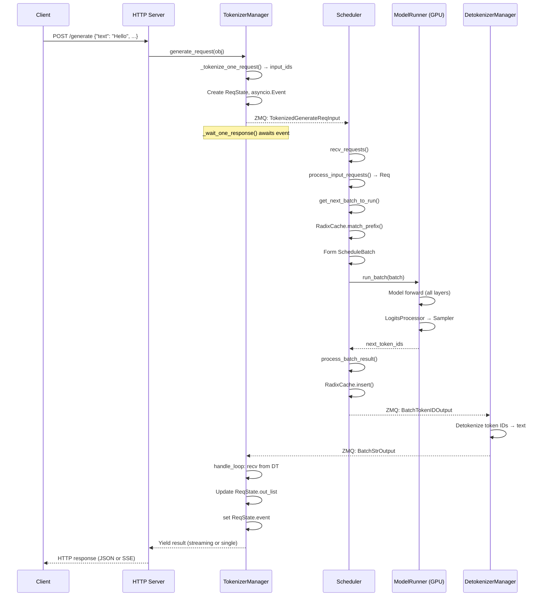

# [SGLang] 开源项目代码深度研究报告

**仓库：** `sgl-project/sglang` (https://github.com/sgl-project/sglang)  
**本地路径：** `d:\codeStudy\sglang`  
**研究日期：** 2026-05-15  
**报告版本：** v2.0  
**研究深度：** DEEP — 源码级静态分析、架构追踪、CI/CD 审查、配置审计、生态调研  
**目标读者：** 决策者、架构师、开发者、产品/业务负责人  
**研究方法限制：** 无 GPU 环境，所有运行时结论均为静态分析推断，未执行动态验证

---

## 1. 执行摘要

### 1.1 一句话结论

SGLang 是一个**架构优秀、性能领先、扩展性强**的 LLM 推理服务引擎，Apache 2.0 许可且由非营利组织 LMSYS 维护，适合学习、集成、二开和生产部署，但需要投入运维和安全基础设施才能在互联网环境中安全运行。

### 1.2 是否值得使用 / 学习 / 二开 / 生产部署

| 目标 | 推荐等级 | 理由 | 关键风险 |
|---|---|---|---|
| **学习 LLM 推理** | ⭐⭐⭐⭐⭐ **强烈推荐** | 架构清晰、扩展体系完善、核心模式可迁移 | 学习曲线较陡（多进程、CUDA、分布式） |
| **个人/团队使用** | ⭐⭐⭐⭐⭐ **强烈推荐** | pip install + 一行命令启动；OpenAI 兼容 API | 需要 GPU (≥8GB VRAM) |
| **内部生产部署** | ⭐⭐⭐⭐ **推荐** | 性能领先（RadixAttention + overlap 调度）；多厂商硬件支持；完善的观测性 | 需配置 auth + 反向代理；运维需 GPU 经验 |
| **集成到产品 (OEM)** | ⭐⭐⭐⭐ **推荐** | Apache 2.0；Engine API 可编程调用；插件系统可定制 | 需跟踪上游快速迭代 |
| **二次开发** | ⭐⭐⭐⭐ **推荐** | 插件/注册表/Hook 体系完善；模型自动发现；28 个 attention 后端可参考 | server_args.py (7,950行) 是主要摩擦点 |
| **商业化 (SaaS)** | ⭐⭐⭐ **可行但有挑战** | Apache 2.0 允许；非营利治理降低 fork 风险 | 需自建多租户、计费、合规；上游迭代快 |

### 1.3 Top 5 发现

1. **RadixAttention (字典树前缀缓存) 是核心差异化优势** — 自动共享相同前缀的 KV cache，对多轮对话、RAG、agent 工作负载有显著加速效果
2. **三进程子进程微内核架构 (TokenizerManager → Scheduler → Detokenizer via ZMQ IPC)** — 提供 GIL 隔离、故障隔离、语言边界灵活性
3. **12+ Mixin 类组合 Scheduler** — 模块化能力组合模式，比单体调度器更可维护、可测试、可扩展
4. **28 个 attention 后端 + 191 个模型自动发现** — 多厂商硬件策略（NVIDIA/AMD/Intel/Ascend/Apple）通过 Registry 模式统一，添加新模型只需一个文件
5. **server_args.py (7,950 行) 是最大的技术债务** — 单一 God Object 被几乎所有模块导入，是维护、测试和二开的主要摩擦点

### 1.4 Top 5 风险

| # | 风险 | 严重度 | 描述 |
|---|---|---|---|
| 1 | **无默认认证** | **高** | `--api-key` 可选，默认无认证；直接暴露到网络可被任意访问 |
| 2 | **无内置限流** | **中** | 易受资源耗尽攻击；需 API 网关或自定义中间件 |
| 3 | **非营利治理** | **中** | LMSYS 是研究实验室，不提供企业支持合同；vLLM Inc. 等竞品有商业实体支撑 |
| 4 | **快速迭代** | **中** | 12,649+ commits；API 表面可能不兼容变化；无正式的语义版本控制 |
| 5 | **运维复杂度** | **中** | 多进程、多 GPU、多节点调试困难；无生产级 K8s manifests 或 Helm charts |

---

## 2. 项目定位

### 2.1 项目身份

| 属性 | 值 | 证据 |
|---|---|---|
| **项目名称** | SGLang (Structured Generation Language) | README, pyproject.toml |
| **仓库** | sgl-project/sglang | README |
| **许可证** | Apache License 2.0 | LICENSE:1-3 |
| **版权所有** | 2023-2024 SGLang Team | 所有源文件头 |
| **维护组织** | LMSYS (Large Model Systems Organization) — 非营利 | README:81, sgl-project GitHub org |
| **主要语言** | Python (1,976+ .py 文件) + Rust (gRPC) + CUDA/C++ (kernels) | 仓库统计 |
| **版本** | setuptools-scm 动态 (git tags) | pyproject.toml:205-209 |
| **总提交数** | 12,649+ | git log |
| **Stars (推测)** | 40K+ (README 声明 "400K GPUs deployed globally") | README |

### 2.2 问题域

SGLang 解决 **大语言模型 (LLM) 的高性能推理服务**问题：
- **高速 token 生成** — overlap 调度、CUDA graphs、RadixAttention 前缀缓存
- **结构化输出** — JSON/Regex/Grammar 约束解码 (xgrammar/outlines/llguidance)
- **多模型和硬件支持** — 191 个模型架构，NVIDIA/AMD/Intel/Ascend/Apple 硬件
- **分布式推理** — TP/PP/EP/DP 多维并行 + 预填-解码分离

### 2.3 用户群体

| 用户类型 | 需求 | SGLang 如何满足 |
|---|---|---|
| **AI 应用开发者** | 快速集成 LLM 推理 | OpenAI 兼容 API；pip install 一键安装 |
| **ML 工程师** | 高性能模型推理 | 连续批处理、前缀缓存、投机解码 |
| **平台工程师** | 生产化部署 | Docker 多架构支持、Prometheus/Grafana/OTEL、健康检查 |
| **研究者** | 实验新推理技术 | 插件/注册表/Hook 体系；前端 DSL |
| **硬件厂商** | 适配新硬件 | SRTPlatform 插件接口；attention/MoE 后端注册 |

### 2.4 项目类型

**LLM 推理服务引擎** — 属于 "Model Serving / Inference" 类别，专注高吞吐低延迟的 LLM 文本生成。

### 2.5 成熟度与社区健康

| 信号 | 评级 | 证据 |
|---|---|---|
| **代码活跃度** | **A (极高)** | 74 个 CI 工作流，日构建和发布，自动依赖升级 bot |
| **测试基础设施** | **A** | 8 种硬件平台 CI，多阶段 PR 测试 (A/B/C)，动态测试分区 |
| **文档** | **B+** | 完善的功能文档、博客、示例；API 文档较简略 |
| **社区治理** | **B** | LMSYS 非营利维护；无 CLA；外部贡献者比例未知 |
| **发布节奏** | **A** | PyPI 日构建 + Docker 日构建 + 版本发布 |
| **向后兼容** | **C** | 无正式弃用策略；setuptools-scm 动态版本；server_args.py 频繁变更 |

---

## 3. 技术栈全景

### 3.1 技术栈矩阵

| 层次 | 技术 | 版本 | 用途 |
|---|---|---|---|
| **深度学习框架** | PyTorch | 2.11.0 | 模型定义、自动微分、分布式通信 |
| **GPU 内核** | FlashInfer, Triton, CUDA/CUTLASS, sgl-kernel | 0.6.11, latest, 12.9/13.0 | Attention 计算、MoE dispatch、量化 GEMM |
| **HTTP 服务** | FastAPI + uvicorn/granian | latest | REST API，SSE 流式响应 |
| **IPC** | ZMQ (pyzmq) | ≥25.1.2 | TokenizerManager ↔ Scheduler ↔ Detokenizer 通信 |
| **模型加载** | HuggingFace transformers | 5.6.0 | 模型配置解析、权重加载、tokenizer |
| **结构化输出** | xgrammar, outlines, llguidance | 0.2.0, latest, latest | JSON/Regex/Grammar 约束解码 |
| **分布式通信** | NCCL/RCCL, Mooncake RDMA | latest | TP/PP/EP 通信、KV cache 传输 |
| **序列化** | safetensors, msgpack, pickle | latest | 权重加载、IPC 消息序列化 |
| **构建** | setuptools + setuptools_scm + setuptools_rust | latest | Python 包构建、Rust 扩展编译 |
| **观测** | prometheus_client, opentelemetry | latest | Metrics、分布式追踪 |
| **容器** | Docker (BuildKit, multi-stage, multi-arch) | latest | 多平台 Docker 镜像 |
| **可选: Rust gRPC** | PyO3 + tonic + maturin | latest | 高性能 gRPC 推理服务 |
| **可选: RL 训练** | verl, AReaL, slime | latest | RLHF 训练中的推理 rollout |
| **可选: 模型网关** | sgl-model-gateway (Rust) | latest | 多模型路由、负载均衡 |

### 3.2 构建、测试、运行时

| 阶段 | 工具 | 配置 |
|---|---|---|
| **构建** | pip, setuptools-scm, Docker BuildKit | pyproject.toml (Python), Cargo.toml (Rust), CMake (C++/CUDA) |
| **测试** | pytest + parameterized + pytest-cov + expecttest | .coveragerc, test/run_suite.py |
| **Lint** | ruff, isort, black, codespell, clang-format | .pre-commit-config.yaml |
| **CI** | GitHub Actions (74 工作流) | .github/workflows/ |
| **安全扫描** | Trivy (容器扫描) | .github/workflows/trivy-scan-dev.yml |
| **运行时** | Python 3.10+, CUDA 12.6+/13.0+, ROCm 7.0/7.2, CANN 8.5 |

### 3.3 外部依赖与服务

- **HuggingFace Hub** — 模型下载
- **ModelScope** — 中国区模型下载 (可选)
- **AWS S3** — 模型存储、SageMaker 部署
- **Docker Hub** — 预构建 Docker 镜像 (`lmsysorg/sglang`)
- **GitHub Container Registry / Releases** — Nightly wheels
- **Prometheus + Grafana** — 监控栈
- **Jaeger / OpenTelemetry Collector** — 分布式追踪

### 3.4 技术选型评价

| 选型 | 评价 | 替代考虑 |
|---|---|---|
| **FastAPI** | ✅ 成熟、生态好、文档完善 | Granian 已支持（HTTP/2） |
| **ZMQ IPC** | ✅ 高性能、跨语言、成熟 | Redis pub/sub (更运维友好但增加延迟) |
| **FlashInfer** | ✅ SOTA attention 内核 | Triton attention (更可移植但更慢) |
| **PyTorch** | ✅ 行业标准 | MLX (Apple), JAX (TPU) — 已部分支持 |
| **sgl-kernel (自研)** | ✅ 深度优化 | 增加维护负担 |

---

## 4. 仓库结构

### 4.1 注释版目录树

```
sglang/                                    # 仓库根目录
├── README.md                              # 项目介绍、性能声明、快速开始
├── LICENSE                                # Apache 2.0
├── .pre-commit-config.yaml                # 25+ lint/formatter hooks
├── .github/workflows/                     # 74 个 CI/CD 工作流
│   ├── pr-test.yml                        # 主 PR 测试 (A/B/C 三阶段)
│   ├── release-docker.yml                 # Docker 发布 (framework/runtime)
│   ├── release-pypi.yml                   # PyPI 发布
│   ├── nightly-test-nvidia.yml            # 每日 NVIDIA GPU 测试
│   ├── nightly-test-amd.yml               # 每日 AMD GPU 测试
│   ├── lint.yml                           # Ruff/isort/codespell
│   └── trivy-scan-dev.yml                 # 容器漏洞扫描
├── docker/                                # 8 种 Dockerfile (NVIDIA/AMD/NPU/XPU/Xeon/ARM/SageMaker/Gateway)
├── python/                                # 主 Python 包
│   ├── pyproject.toml                     # 构建配置、依赖、入口点
│   └── sglang/
│       ├── cli/                           # CLI 入口 (serve, generate, version, killall)
│       ├── launch_server.py               # 服务器启动器
│       ├── profiler.py                    # 客户端性能分析器
│       ├── check_env.py                   # 环境验证
│       └── srt/                           # 核心推理运行时 (SGLang Runtime)
│           ├── server_args.py             # 7,950 行配置 God Object
│           ├── environ.py                 # 80+ SGLANG_* 环境变量 (EnvField 描述符)
│           ├── constants.py               # 服务器常量
│           ├── entrypoints/               # 入口点
│           │   ├── engine.py              # Engine 类 (子进程启动器)
│           │   ├── EngineBase.py          # Engine 抽象基类
│           │   ├── http_server.py         # FastAPI HTTP 服务器 (~40 路由)
│           │   └── grpc_server.py         # gRPC 服务器
│           ├── managers/                  # 核心管理器
│           │   ├── scheduler.py           # 调度器 (12+ mixin 组合)
│           │   ├── tokenizer_manager.py   # Tokenizer 管理器 (asyncio)
│           │   ├── schedule_batch.py      # Req + ScheduleBatch 数据模型
│           │   ├── schedule_policy.py     # 调度策略
│           │   ├── io_struct.py           # IPC 消息类型
│           │   └── scheduler_profiler_mixin.py  # 性能分析
│           ├── model_executor/            # GPU 模型执行
│           │   ├── model_runner.py        # ModelRunner (forward, 模型加载)
│           │   ├── forward_batch_info.py  # ForwardBatch 数据模型
│           │   └── cuda_graph_runner.py   # CUDA 图捕获和回放
│           ├── models/                    # 191 个模型架构文件
│           │   ├── registry.py            # 模型自动发现注册表
│           │   └── llama.py, qwen2.py, ... # 各模型实现
│           ├── layers/                    # 神经网络层
│           │   ├── radix_attention.py     # RadixAttention 包装器
│           │   ├── attention/             # 28 个 attention 后端
│           │   ├── quantization/          # 40+ 量化方法
│           │   └── moe/                   # MoE runner 和 dispatcher
│           ├── mem_cache/                 # 内存管理
│           │   ├── radix_cache.py         # Radix 树前缀缓存
│           │   ├── memory_pool.py         # KV cache 内存池
│           │   └── allocator.py           # 页面分配器
│           ├── speculative/               # 投机解码
│           │   ├── eagle_worker.py        # EAGLE draft 模型
│           │   ├── eagle_info.py          # EagleVerifyInput 数据结构
│           │   └── spec_registry.py       # 投机算法注册表
│           ├── constrained/               # 约束解码
│           │   └── grammar_manager.py     # 语法管理器 (异步 ThreadPool)
│           ├── disaggregation/            # 预填-解码分离
│           │   ├── base/conn.py           # 抽象传输接口
│           │   ├── mooncake/              # Mooncake RDMA 传输
│           │   └── nixl/                  # NIXL NVLink 传输
│           ├── distributed/               # 分布式推理
│           │   └── parallel_state.py      # TP/PP/DP 组协调
│           ├── plugins/                   # 插件系统
│           │   └── __init__.py            # setuptools entry_points 发现
│           ├── observability/             # 可观测性
│           │   ├── metrics_collector.py   # 50+ Prometheus metrics
│           │   ├── trace.py               # OpenTelemetry 追踪
│           │   └── req_time_stats.py      # 请求时间统计
│           ├── eplb/                      # 专家并行负载均衡
│           ├── sampling/                  # 采样器
│           └── utils/                     # 工具函数
├── sgl-kernel/                            # 自研 CUDA 内核 (独立包)
├── sgl-model-gateway/                     # 模型网关 (Rust)
├── test/                                  # 测试套件
│   ├── srt/                               # 单元/集成测试
│   └── run_suite.py                       # 测试编排器
├── examples/                              # 示例
│   ├── monitoring/                        # Prometheus + Grafana + Jaeger
│   └── frontend_language/                 # 前端 DSL 示例
└── docs_new/                              # 文档
```

### 4.2 入口点地图

| 入口点 | 类型 | 位置 | 用途 |
|---|---|---|---|
| `sglang serve` | CLI | cli/main.py → cli/serve.py | 启动 HTTP 推理服务器 |
| `sglang generate` | CLI | cli/generate.py | 单次推理 |
| `sglang version` | CLI | cli/main.py:7-9 | 打印版本 |
| `killall_sglang` | CLI | cli/killall.py | 终止所有 SGLang 进程 |
| `from sglang import Engine` | Python SDK | entrypoints/engine.py:174 | 程序化推理引擎 |
| `POST /generate` | HTTP API | entrypoints/http_server.py | 文本生成 (原生 API) |
| `POST /v1/chat/completions` | HTTP API | entrypoints/http_server.py | OpenAI 兼容 API |
| `POST /v1/messages` | HTTP API | entrypoints/anthropic/ | Anthropic 兼容 API |
| gRPC | RPC | entrypoints/grpc_server.py | 高性能 gRPC 推理 |

### 4.3 配置文件地图

| 配置源 | 位置 | 优先级 | 条目数 |
|---|---|---|---|
| 环境变量 (`SGLANG_*`) | environ.py | 1 (最高 — Python import 时加载) | 80+ |
| CLI 参数 (`--*`) | server_args.py | 2 | 200+ |
| ServerArgs 后处理 | server_args.py `__post_init__` | 3 (派生值) | ~50 |
| 模型配置 (`config.json`) | model_config.py | 4 (覆盖部分 ServerArgs 默认值) | 模型相关 |
| 运行时环境变量覆盖 | environ.py `EnvField.override()` | 5 (测试用) | — |

### 4.4 文档与源码一致性

| 领域 | 一致性 | 评价 |
|---|---|---|
| **README 功能声明** | ✅ 高 | 所有核心功能在源码中确认 |
| **性能声明** | ⚠️ 无法验证 | 无 GPU 环境，未运行 benchmark |
| **安装指南** | ✅ 高 | pip install + Docker 均可 |
| **API 文档** | ⚠️ 中 | HTTP 路由与代码一致；部分参数文档不完整 |
| **server_args.py 文档** | ⚠️ 中 | 大部分字段有 docstring；部分选项缺少使用示例 |
| **环境变量文档** | ✅ 高 | environ.py 中每个变量都有注释说明 |

---

## 5. 架构设计

### 5.1 架构模式

SGLang 采用 **Layered + Subprocess Microkernel + Plugin-based** 架构：

```
┌─────────────────────────────────────────────────────────┐
│                    API Layer                             │
│  HTTP (FastAPI) | gRPC | Engine API | Frontend DSL      │
├─────────────────────────────────────────────────────────┤
│                  Orchestration Layer                     │
│  TokenizerManager ←→ Scheduler (12+ mixins) ←→ Detokenizer │
│       (asyncio)         (sync, GPU)            (sync)    │
│                    ↕ ZMQ IPC ↕                            │
├─────────────────────────────────────────────────────────┤
│                   Execution Layer                        │
│  ModelRunner → Model(191) → Attention(28 backends)       │
│  MemoryPool → RadixCache → Sampler                       │
├─────────────────────────────────────────────────────────┤
│                  Infrastructure Layer                    │
│  PyTorch | NCCL | CUDA | FlashInfer | ZMQ | xgrammar    │
└─────────────────────────────────────────────────────────┘
```

### 5.2 模块边界

| 模块 | 职责 | 输入 | 输出 | 不负责 |
|---|---|---|---|---|
| **TokenizerManager** | HTTP 请求接收、tokenization、响应返回 | HTTP request | HTTP response (SSE/JSON) | GPU 推理 |
| **Scheduler** | 请求调度、批处理形成、KV cache 管理 | Tokenized requests via ZMQ | Batch results via ZMQ | Tokenization |
| **DetokenizerManager** | Token ID → 文本转换 | Token ID batches via ZMQ | Decoded text via ZMQ | GPU 推理 |
| **ModelRunner** | 模型加载、前向传播、CUDA 图管理 | ScheduleBatch | next_token_ids (logits) | 调度决策 |
| **RadixCache** | 前缀缓存匹配、插入、驱逐 | Token sequences | KV cache indices | GPU 执行 |
| **GrammarManager** | 语法编译、约束解码状态管理 | JSON schema/regex | BaseGrammarObject | GPU 执行 |

### 5.3 分层结构

- **Layer 1 (API):** HTTP 路由、请求验证、OpenAI/Anthropic/Ollama 协议适配
- **Layer 2 (Orchestration):** 三进程流水线 (Tokenizer → Scheduler → Detokenizer) + ZMQ IPC
- **Layer 3 (Execution):** GPU 上的模型执行、attention 分发、采样、缓存管理
- **Layer 4 (Infrastructure):** PyTorch、CUDA、NCCL、FlashInfer 等底层依赖

### 5.4 模块依赖图

```mermaid
graph TD
    subgraph "API Layer"
        CLI[CLI (cli/main.py)]
        HTTP[HTTP Server (http_server.py)]
        GRPC[gRPC Server]
    end

    subgraph "Orchestration"
        ENGINE[Engine (engine.py)]
        TM[TokenizerManager]
        SCHED[Scheduler<br/>12+ mixins]
        DT[DetokenizerManager]
    end

    subgraph "Execution"
        MR[ModelRunner]
        MODELS[Model Registry<br/>191 models]
        ATTENTION[Attention Registry<br/>28 backends]
        MOE[MoE Runners + Dispatchers]
    end

    subgraph "Memory & Cache"
        RC[RadixCache]
        MP[MemoryPool]
        ALLOC[PageAllocator]
    end

    subgraph "Features"
        SPEC[Speculative Decoding]
        GRAMMAR[Grammar Manager]
        DISAGG[Disaggregation]
        LORA[LoRA Manager]
    end

    subgraph "Config"
        SA[server_args.py<br/>God Object]
        ENV[environ.py<br/>80+ env vars]
    end

    CLI --> ENGINE
    HTTP --> TM
    GRPC --> ENGINE
    ENGINE --> TM
    ENGINE --> SCHED
    ENGINE --> DT
    TM -.ZMQ.-> SCHED
    SCHED -.ZMQ.-> DT
    DT -.ZMQ.-> TM
    SCHED --> MR
    MR --> MODELS
    MODELS --> ATTENTION
    MR --> MOE
    SCHED --> RC
    SCHED --> MP
    SCHED --> GRAMMAR
    SCHED --> DISAGG
    SCHED --> LORA
    SCHED --> SPEC
    MR --> RC
    MR --> MP
    SA -.imported by everything.-> CLI
    SA -.imported by everything.-> HTTP
    SA -.imported by everything.-> ENGINE
    SA -.imported by everything.-> SCHED
    SA -.imported by everything.-> MR
    ENV --> SA
```

### 5.5 架构优点、债务与扩展性

**优点:**
1. **GIL 隔离** — 三进程设计消除 Python GIL 竞争
2. **故障隔离** — 子进程崩溃可通过 watchdog 重启
3. **Mixin 组合** — Scheduler 能力模块化 (12+ mixins)
4. **Registry 模式** — 模型、attention、MoE、spec 算法、grammar 均通过注册表可插拔
5. **插件系统** — setuptools entry_points + HookRegistry 支持外部扩展
6. **Overlap 调度** — CPU 和 GPU 并行执行，零开销批处理

**债务:**
1. **server_args.py God Object** — 7,950 行，被所有模块导入；变更影响全局
2. **循环依赖** — layers ↔ mem_cache, layers ↔ models, layers ↔ model_executor
3. **ZMQ IPC 隐式契约** — 消息格式无正式 schema；版本升级可能破坏兼容性
4. **Mixin 依赖隐含** — 12+ mixin 之间的调用顺序和依赖没有显式文档

**扩展性:**
- **高扩展性**: 模型添加（1 个文件）、attention 后端（注册装饰器）、spec 算法（注册装饰器）、grammar 后端（工厂模式）、硬件平台（entry_points 插件）

---

## 6. 启动链路

### 6.1 Bootstrap 调用链

```
sglang serve --model-path <model> --port 30000
  → cli/main.py:main() → serve(args, extra_argv)
    → launch_server.py:run_server(server_args)
      → 分支选择:
        HTTP mode: http_server.py:launch_server()
        gRPC mode: grpc_server.py:serve_grpc()
        Ray mode: ray distributed launch
        Encoder mode: encoder server

HTTP 模式:
  → http_server.py:_app_factory()
    → ServerArgs 实例化 (解析 CLI + 环境变量)
    → 模型配置加载 (HF config.json)
    → 插件加载 (plugins/__init__.py:load_plugins())
    → 模型运行器初始化 (ModelRunner.load_model())
      → 权重下载/加载
      → KV cache 内存分配
      → CUDA 图捕获 (decode batch sizes)
      → 内核预热 (FlashInfer autotune, torch.compile)
    → Engine 子进程启动 (engine.py:_launch_subprocesses())
      → fork TokenizerManager (asyncio)
      → fork Scheduler (GPU worker)
      → fork DetokenizerManager
    → ZMQ IPC 通道建立
    → FastAPI app 创建 + 路由注册
    → uvicorn/granian 启动 HTTP 服务器
```

### 6.2 配置加载顺序

1. `SGLANG_*` 环境变量 → environ.py EnvField 描述符 (Python import 时加载)
2. CLI 参数 → server_args.py argparse 解析
3. ServerArgs `__post_init__` → 派生值、GPU 检测、自动配置
4. 模型 config.json → 覆盖部分默认值（如 context_length）
5. 运行时覆盖 → `envs.FLAG.override()` 上下文管理器

### 6.3 插件注册

- **Platform 插件**: `SGLANG_PLATFORM` 环境变量选择 → setuptools entry_points `sglang.srt.platforms` 组
- **General 插件**: `SGLANG_PLUGINS` 环境变量白名单 → setuptools entry_points `sglang.srt.plugins` 组
- **Hook 注册**: 插件在加载时通过 `HookRegistry.register_hook()` 注入 before/after 回调 → `HookRegistry.apply_hooks()` 在插件全部加载后应用

### 6.4 Graceful Shutdown

- SIGTERM/SIGINT → `_GlobalState.gracefully_exit = True` → `/health` 返回 503 → 等待进行中的请求完成 → 关闭 ZMQ 套接字 → 子进程 join(timeout)
- 强制终止: `killall_sglang` CLI 命令

---

## 7. 核心功能

### 7.1 功能矩阵

| 功能 | 成熟度 | 性能影响 | 复杂度 | 可改造性 |
|---|---|---|---|---|
| **连续批处理 (Continuous Batching)** | Production | 核心 — 决定吞吐量 | 中 (调度算法) | 策略可替换 |
| **RadixAttention 前缀缓存** | Production | 高 — 共享前缀场景 2-5x | 中 (字典树) | 驱逐策略可替换 |
| **Overlap 调度** | Production | 高 — 20-30% 吞吐提升 | 高 (FutureMap 环形缓冲) | 有限 |
| **投机解码 (EAGLE/NGRAM)** | Production | 高 — 2-3x 吞吐 | 高 (draft + verify) | 算法可插拔 |
| **结构化输出 (JSON/Regex/Grammar)** | Production | 中 (额外验证开销) | 中 (异步编译) | Grammar 后端可替换 |
| **预填-解码分离 (PD Disaggregation)** | Production | 高 — 大规模部署 | 极高 (RDMA KV 传输) | 传输后端可替换 |
| **CUDA Graphs** | Production | 高 — 2-5x decode 加速 | 中 (捕获/回放/填充) | 有限 |
| **LoRA (多适配器)** | Production | 中 | 中 | 后端可替换 |
| **MoE 专家并行** | Production | 高 — 大模型必备 | 高 (all-to-all 通信) | 后端可插拔 |
| **多模态 (图像/视频/音频)** | Production | 中 | 高 (编码器) | — |

### 7.2 核心调用链: 请求生命周期

```
HTTP POST /generate {"text": "Hello", "sampling_params": {...}}
  → http_server.py:generate_request()
    → TokenizerManager.generate_request()
      → _tokenize_one_request() → input_ids: List[int]
      → 创建 ReqState + asyncio.Event
      → ZMQ PUSH: TokenizedGenerateReqInput → Scheduler
      → await event.wait() (等待响应)
        → Scheduler.recv_requests()
          → process_input_requests() → Req 对象
          → get_next_batch_to_run()
            → RadixCache.match_prefix() → 前缀匹配
            → PrefillAdder.add_one_req() → token 预算检查
            → ScheduleBatch 形成
          → run_batch(batch)
            → ModelRunner.forward()
              → 每层: RadixAttention → AttentionBackend.forward_decode/extend
              → LogitsProcessor
              → Sampler.forward() → next_token_ids
          → process_batch_result()
            → RadixCache.insert() → 更新前缀树
            → ZMQ PUSH: BatchTokenIDOutput → DetokenizerManager
              → detokenize() → 文本
              → ZMQ PUSH: BatchStrOutput → TokenizerManager
                → handle_loop() → ReqState.out_list 更新
                → event.set() → HTTP 响应 (JSON 或 SSE 流)
```

### 7.3 核心算法

**RadixAttention (字典树前缀缓存):**
1. 新请求到达 → 在字典树中匹配最长公共前缀
2. 命中前缀 → 复用已缓存的 KV cache indices
3. 新 token 生成 → 插入字典树新节点
4. 内存不足 → 驱逐策略 (LRU/LFU/FIFO) 释放叶子节点

**Overlap 调度 (CPU/GPU 并行):**
1. 批次 N 启动 GPU 前向传播
2. 在 GPU 执行期间，CPU 准备批次 N+1
3. 批次 N 的结果推迟到 N+1 启动后处理
4. 通过 FutureMap 环形缓冲区管理未解析的 token ID

### 7.4 状态变化

| 阶段 | Req 状态 | KV cache 状态 | Grammar 状态 |
|---|---|---|---|
| 接收 | `waiting_queue` | 未分配 | 编译中 (异步 ThreadPool) |
| 调度 | `running_batch` (EXTEND) | `alloc()` 分配页面 | `accept_token()` 初始化 |
| 前向 | GPU 计算 | 写入 attention KV | — |
| 采样 | `output_ids` 追加 | `insert()` 字典树更新 | `accept_token()` 推进 |
| 完成 | 从 `running_batch` 移除 | 可选: `cache_finished_req()` | 释放 |

---

## 8. 数据流

### 8.1 核心数据模型

```
GenerateReqInput (客户端 → HTTP)
  ├── text: str
  ├── sampling_params: dict (temperature, top_p, max_new_tokens, ...)
  └── stream: bool

    ↓ Tokenization

TokenizedGenerateReqInput (TokenizerManager → Scheduler via ZMQ)
  ├── rid: str
  ├── input_ids: List[int]
  └── sampling_params: SamplingParams

    ↓ Scheduling

Req (调度器内部 — schedule_batch.py:578)
  ├── origin_input_ids, output_ids, fill_ids
  ├── prefix_indices (KV cache 位置)
  ├── kv_committed_len, kv_allocated_len
  └── grammar, lora_id, priority

ScheduleBatch (GPU 批次 — schedule_batch.py:1381)
  ├── reqs: List[Req]
  ├── forward_mode: EXTEND | DECODE
  └── input_ids, seq_lens, prefix_lens, output_ids (tensors)

    ↓ Forward

ForwardBatch (GPU 端 — forward_batch_info.py)
  ├── forward_mode: EXTEND | DECODE | TARGET_VERIFY
  ├── positions, req_pool_indices, extend_seq_lens
  └── attn_backend (分发到 28 个后端之一)

    ↓ Processing

BatchTokenIDOutput (Scheduler → DetokenizerManager via ZMQ)
  ├── rids: List[str]
  ├── next_token_ids: List[List[int]]
  └── finished: List[bool]

BatchStrOutput (DetokenizerManager → TokenizerManager via ZMQ)
  ├── rids: List[str]
  ├── output_strs: List[str]
  └── finished_reasons: List[FinishReason]
```

### 8.2 请求/响应流



### 8.3 KV Cache 层次结构

```
Layer 1: GPU HBM
├── ReqToTokenPool: [max_requests × max_tokens] → KV 位置索引
├── MHATokenToKVPool: k_cache + v_cache (FP16/BF16/FP8)
└── RadixCache (CPU 字典树): token 序列 → KV indices

Layer 2: CPU RAM (可选 — HiCache)
├── HiRadixCache: GPU → CPU KV 页面交换
└── 存储后端: Redis, S3, 本地磁盘, Mooncake

Layer 3: 网络传输 (Disaggregation)
├── Prefill server → Decode server: KV cache RDMA 传输
└── 后端: Mooncake (RDMA), NIXL (NVLink), Mori (AMD), Ascend
```

---

## 9. API / SDK / CLI

### 9.1 对外接口清单

| 接口 | 协议 | 端点/方法 | 兼容性 |
|---|---|---|---|
| **SGLang Native** | HTTP REST | `/generate`, `/encode`, `/classify`, `/health`, `/health_generate`, `/flush_cache`, `/start_profile`, `/stop_profile`, `/update_weights_from_disk`, `/update_weights_from_tensor`, `/metrics`, `/v1/loads` | SGLang 自有 |
| **OpenAI Compatible** | HTTP REST | `/v1/completions`, `/v1/chat/completions`, `/v1/embeddings`, `/v1/models`, `/v1/responses` | OpenAI API 兼容 |
| **Anthropic Compatible** | HTTP REST | `/v1/messages` | Anthropic Messages API 兼容 |
| **Ollama Compatible** | HTTP REST | `/api/generate`, `/api/chat`, `/api/tags`, `/api/pull` | Ollama API 兼容 |
| **SageMaker** | HTTP REST | `POST /invocations` (via SageMaker Docker) | AWS SageMaker |
| **Vertex AI** | HTTP REST | Google Cloud Vertex AI 适配器 | GCP Vertex AI |
| **Python SDK (Engine)** | Python API | `Engine(model_path=...).generate(...)`, `.encode(...)`, `.flush_cache(...)`, `.shutdown()` | 程序化调用 |
| **Python DSL** | Python API | `sglang.function`, `sglang.gen()`, `sglang.select()`, `sglang.regex()` | 前端 DSL |
| **gRPC** | gRPC (Protobuf) | proto/ 定义的服务 | Beta (Rust 实现) |
| **CLI** | Shell | `sglang serve`, `sglang generate`, `sglang version`, `killall_sglang` | 命令行 |

### 9.2 最小调用示例

```bash
# CLI: 启动服务器
sglang serve --model-path meta-llama/Llama-3.2-3B-Instruct --port 30000

# CLI: 单次生成
sglang generate --model-path meta-llama/Llama-3.2-3B-Instruct --prompt "Hello!"

# HTTP: OpenAI 兼容
curl http://localhost:30000/v1/chat/completions \
  -H "Content-Type: application/json" \
  -d '{"model": "Llama-3.2-3B-Instruct", "messages": [{"role": "user", "content": "Hello!"}]}'

# Python: Engine API
from sglang import Engine
engine = Engine(model_path="meta-llama/Llama-3.2-3B-Instruct")
result = engine.generate("Hello!", {"max_new_tokens": 100})
engine.shutdown()
```

### 9.3 版本和兼容性

- **无 API 版本前缀** (除 OpenAI 兼容的 `/v1/` 路径外)
- **无正式弃用策略** — 字段可能无警告移除
- **setuptools-scm 动态版本** — 版本号来自 git tags，无语义版本保证
- **环境变量有弃用警告系统** — environ.py:667-736 提供旧名 → 新名映射

---

## 10. 扩展点与二次开发

### 10.1 扩展点总览

| 扩展点 | 类型 | 注册方式 | 难度 |
|---|---|---|---|
| **硬件平台** | setuptools entry_points | `SGLANG_PLATFORM` env var | 高 |
| **通用插件** | setuptools entry_points | `SGLANG_PLUGINS` env var | 中 |
| **Attention 后端** | @register_attention_backend 装饰器 | 自动发现 | 高 |
| **模型架构** | 模块级 `EntryClass = MyModel` | `pkgutil.iter_modules` 自动扫描 | 中 |
| **Grammar 后端** | 工厂函数 | 修改 `create_grammar_backend()` | 中 |
| **Spec 算法** | @register_algorithm 装饰器 | 自动发现 | 高 |
| **MoE Runner** | 目录 + 工厂 | 注册在 `__init__.py` | 高 |
| **LoRA 后端** | 字典注册 | 修改 `lora_registry.py` | 中 |
| **调度策略** | 策略类 | 修改 `schedule_policy.py` | 低 |
| **传输后端 (Disaggregation)** | 抽象基类实现 | 目录放置 + 注册 | 高 |
| **Hook 注入** | `HookRegistry.register_hook()` | 在插件中调用 | 低 |

### 10.2 二开任务分级

| 级别 | 任务示例 | 文件数 | 时间 | 风险 |
|---|---|---|---|---|
| **L1: 快速修改** | 添加 `--log-every-request` 标志 | 2-3 | 1 天 | 低 |
| **L1: 快速修改** | 添加新的调度策略 | 1-2 | 1-2 天 | 低 |
| **L1: 快速修改** | 添加健康检查端点 | 1 | 1 天 | 低 |
| **L2: 中等集成** | 添加新模型架构 | 1 个新文件 | 1-3 天 | 低 |
| **L2: 中等集成** | 添加 attention 后端 | 2-3 | 3-5 天 | 中 |
| **L2: 中等集成** | 添加 HTTP 中间件 (限流) | 1-2 | 2-3 天 | 低 |
| **L3: 深度改造** | 添加投机算法 | 3-5 | 2-3 周 | 高 |
| **L3: 深度改造** | 新硬件平台支持 | 5-10 | 4-8 周 | 高 |
| **L3: 深度改造** | 替换 IPC 为 Redis | 5-10 | 2-4 周 | 高 |

### 10.3 商业化可行性

| 场景 | 可行性 | 改动 | 成本 | 风险 |
|---|---|---|---|---|
| **原样使用 (self-hosted)** | 高 | 无 | 低 (仅 GPU) | 低 |
| **私有化部署** | 高 | Docker + k8s + 网络安全 | 1-2 周 | 中 |
| **嵌入产品 (OEM)** | 中 | Engine API 封装 + license 审核 | 2-4 周 | 低 |
| **添加定制功能** | 中 | 按需修改模型/backend/策略 | 1-3 周 | 中 |
| **Fork 并大改** | 中 | 大量改动 + 追踪上游 | 持续 | 高 (分歧) |
| **替代底层 PyTorch** | 极低 | 全模块重构 | 6+ 月 | 极高 |

---

## 11. 测试与质量

### 11.1 测试基础设施

| 要素 | 详情 |
|---|---|
| **测试框架** | pytest + parameterized + pytest-cov + expecttest |
| **测试目录** | `test/srt/` (单元/集成), `test/manual/` (手动), `test/registered/` (注册测试) |
| **测试编排** | `test/run_suite.py` — 支持分区并行 |
| **CI 平台** | GitHub Actions — 74 个工作流, 8 种硬件平台 |
| **PR 测试** | 三阶段 (A/B/C): 小 GPU → 大 GPU → 多 GPU |
| **Nightly 测试** | NVIDIA (每日), AMD (每日), GB200 72-GPU (每日), Intel (每日), NPU (每日) |
| **Lint** | ruff + isort + black + codespell + clang-format + 20+ 本地 hooks |
| **安全扫描** | Trivy 容器漏洞扫描 (每日) |
| **覆盖率** | pytest-cov + diff-cover; .coveragerc 配置 |

### 11.2 覆盖盲区

| 盲区 | 严重度 | 建议 |
|---|---|---|
| 多节点分布式 | 高 | 添加多 GPU CI + 模型并行测试 |
| 大规模 EP (DeepEP) | 高 | >8 GPU 自动化测试 |
| 错误恢复路径 | 中 | 故障注入测试 (kill scheduler, 耗尽内存) |
| 性能回归 | 中 | 自动化 benchmark 对比 + 阈值告警 |
| 流式响应正确性 | 中 | 流式响应排序/损坏测试 |
| 长时稳定性 | 低-中 | 24 小时连续推理测试 |
| 安全边缘情况 | 中 | Prompt injection, malformed JSON 测试 |

### 11.3 代码质量评分: B+

| 维度 | 评级 | 关键发现 |
|---|---|---|
| Linting | A | 完善的 pre-commit 配置 (25+ checks) |
| 类型安全 | B- | 部分类型提示；无 mypy CI 强制执行 |
| 代码重复 | B | 191 个模型文件共享模式；与 vLLM 类似 |
| 文档 | B+ | 完善的功能文档；API 文档可改进 |
| 错误处理 | B | 关键路径有 try/except；部分裸 except |
| 测试覆盖 | B | 核心功能覆盖良好；缺少多节点和错误恢复测试 |
| 依赖健康 | B+ | 锁定版本，自动升级 bot；需监控 CVE |

---

## 12. 安全与许可证

### 12.1 License 结论: Apache 2.0 — 商业友好

| 方面 | 结论 |
|---|---|
| **商业使用** | ✅ 允许 |
| **分发** | ✅ 允许 (需保留 NOTICE) |
| **修改** | ✅ 允许 (无 copyleft 触发) |
| **专利保护** | ✅ 有 (报复条款) |
| **商标** | ❌ 不授权 (不能使用 "SGLang" 名做商业产品) |
| **GPL 兼容性** | ⚠️ 仅兼容 GPLv3 |

### 12.2 应用安全风险

| 风险 | 严重度 | 缓解 |
|---|---|---|
| **无默认认证** | **高** | 设置 `--api-key`; 使用 API 网关 |
| **无内置限流** | **中** | 使用 API 网关或自定义中间件 |
| **trust_remote_code (默认 True)** | **高** | 生产环境 `--disable-trust-remote-code` |
| **HTTP API key 明文传递** | 低 | 使用 TLS 终端 (nginx/Caddy) |
| **ZMQ IPC 未加密** | 低 (仅本地) | 绑定到 localhost |
| **模型权重未加密** | 中 (静止状态) | 使用加密文件系统 |
| **Prompt 注入** | 中 | 添加注入检测/过滤 |
| **GPU 内存暴露** | 低 (需本地访问) | CUDA MPS 隔离 |

### 12.3 生产安全清单 (Top 5)

1. **必须:** 设置 `--api-key` + TLS 反向代理
2. **必须:** 限制网络绑定 (`--host 127.0.0.1`)
3. **推荐:** `--disable-trust-remote-code` (生产环境)
4. **推荐:** `--log-level warning` (避免数据泄露)
5. **推荐:** 运行 `pip-audit` 或 `trivy` 扫描依赖

---

## 13. 部署与运维

### 13.1 部署方式矩阵

| 方式 | Dockerfile | 多架构 | CI 发布 | 生产成熟度 |
|---|---|---|---|---|
| **NVIDIA CUDA Docker** | docker/Dockerfile (830 行, 多阶段) | amd64 + arm64 | ✅ 版本 + nightly | **高** |
| **AMD ROCm Docker** | docker/rocm.Dockerfile (590 行) | gfx942/gfx950 | ✅ 版本 + nightly | 中-高 |
| **Ascend NPU Docker** | docker/npu.Dockerfile (105 行) | amd64 + arm64 (910b/a3) | ✅ 版本 + nightly | 中 |
| **Intel XPU Docker** | docker/xpu.Dockerfile (80 行) | x86_64 | ✅ | 中 |
| **CPU Xeon Docker** | docker/xeon.Dockerfile (52 行) | x86_64 | ✅ | 中 |
| **CPU ARM Docker** | docker/arm64.Dockerfile (53 行) | aarch64 | ✅ | 中 |
| **SageMaker Docker** | docker/sagemaker.Dockerfile (7 行) | x86_64 | ✅ | 中 |
| **PyPI wheel** | pyproject.toml | Python 3.10-3.13, x86_64+aarch64 | ✅ 版本 + nightly | **高** |

### 13.2 CI/CD 评级: A (生产级)

- 74 个 GitHub Actions 工作流
- 8 种硬件平台 × 多 GPU 配置
- 智能变更检测 (仅测试变更组件)
- ML 驱动的动态测试分区
- 自动依赖升级 bot
- Trivy 安全扫描集成
- 完整的发布自动化 (Branch cut → Tag → PyPI + Docker + Docs)

### 13.3 可观测性评级: A-

50+ Prometheus 指标家族、OpenTelemetry 分布式追踪 (Gen-AI 语义规范)、预构建 Grafana 仪表板、健康检查 (`/health`, `/health_generate`, `/v1/loads`)、PyTorch Profiler 集成。**缺失:** 无内置告警规则、无 SLO 追踪、无审计日志。

---

## 14. 性能与可观测性

### 14.1 热路径

| 热路径 | 位置 | 频率 | 瓶颈类型 |
|---|---|---|---|
| 调度器事件循环 | scheduler.py:1537/1564 | 每批次 (~10-100ms) | CPU — ZMQ recv, 批次形成 |
| KV cache 查找 | radix_cache.py:360 | 每请求入队 | CPU — 字典树遍历 O(depth) |
| Attention 前向 | flashinfer_backend.py | 每批次 | GPU — 内存带宽瓶颈 |
| CUDA 图回放 | cuda_graph_runner.py:1307 | 每 decode 批次 | GPU — kernel 启动开销 |
| ZMQ 序列化 | scheduler.py:1656 | 每轮询 (~1ms) | CPU — pickle 反序列化 |
| Token 采样 | sampler.py | 每批次 | CPU/GPU — top-k/top-p, grammar |
| KV cache 驱逐 | radix_cache.py:560 | 内存压力时 | CPU — 堆操作 O(N log N) |

### 14.2 性能调优关键参数

| 参数 | 默认值 | 影响 | 调优建议 |
|---|---|---|---|
| `--mem-fraction-static` | 自动 (~0.9) | KV cache 容量 | OOM 时降低；更多 cache 时调高 |
| `--max-prefill-tokens` | 16384 | TTFT vs 吞吐 | 低延迟场景降低；高吞吐场景调高 |
| `--cuda-graph-max-bs` | 自动 | Decode 延迟 | 限制 CUDA 图捕获范围 |
| `--schedule-conservativeness` | 1.0 | Token 预算估算 | <1.0 更激进；>1.0 更保守 |
| `--disable-overlap-schedule` | False | CPU/GPU 并行 | **生产中永远不要禁用** |
| `--disable-cuda-graph` | False | Decode 延迟 (2-5x) | **生产中永远不要禁用** |
| `--disable-radix-cache` | False | 共享前缀吞吐 | 无前缀复用时禁用 |

### 14.3 压测建议

| 层级 | 场景 | 工具 | 指标 |
|---|---|---|---|
| **基础** | 单请求延迟 | curl | TTFT, E2E 延迟 |
| **吞吐** | 并发请求 → 饱和 | locust / 自定义脚本 | 最大吞吐 (tokens/s), P99 TTFT |
| **压力** | 80% 最大吞吐 × 24h | 自定义脚本 | 内存泄漏, 性能退化 |
| **突发** | 10x 正常负载 × 5min | 自定义脚本 | 队列行为, OOM 恢复 |
| **长上下文** | 128K context length | 自定义脚本 | 内存分配, 驱逐效率 |

---

## 15. 同类项目对比

### 15.1 竞品能力矩阵

| 能力 | SGLang | vLLM | TensorRT-LLM | TGI | LMDeploy |
|---|---|---|---|---|---|
| **连续批处理** | ✅ Overlap | ✅ PagedAttention | ✅ In-flight | ✅ | ✅ |
| **前缀缓存** | ✅ RadixAttention (trie) | ✅ Auto prefix cache | ⚠️ 有限 | ❌ | ⚠️ |
| **投机解码** | ✅ EAGLE/NGRAM/EAGLE3 | ✅ Eagle/Medusa | ⚠️ Draft model | ❌ | ❌ |
| **结构化输出** | ✅ xgrammar/outlines/llguidance | ✅ Guided decoding | ❌ | ⚠️ | ❌ |
| **OpenAI API** | ✅ + Ollama + Anthropic | ✅ | ⚠️ Via Triton | ✅ | ✅ |
| **AMD ROCm** | ✅ MI300/MI325/MI35x | ✅ MI300X | ❌ | ❌ | ❌ |
| **Ascend NPU** | ✅ | ❌ | ❌ | ❌ | ❌ |
| **FP8/FP4 量化** | ✅ FP8 + FP4 | ✅ FP8 | ✅ Best-in-class | ❌ | ✅ |
| **PD 分离** | ✅ Mooncake/NIXL/Mori/ Ascend | ✅ | ❌ | ❌ | ❌ |
| **gRPC API** | ✅ Beta (Rust) | ❌ | ✅ (Triton) | ✅ (Rust) | ❌ |
| **插件系统** | ✅ entry_points + HookRegistry | ⚠️ 有限 | ❌ | ❌ | ❌ |
| **前端 DSL** | ✅ sglang.lang | ❌ | ❌ | ❌ | ❌ |
| **License** | Apache 2.0 | Apache 2.0 | Apache 2.0 | Apache 2.0 (HF) | Apache 2.0 |
| **治理** | LMSYS (非营利) | vLLM Inc. (创业公司) | NVIDIA (公司) | HuggingFace (创业公司) | Shanghai AI Lab |

### 15.2 SGLang 独特优势

1. **RadixAttention** — 自动字典树前缀缓存 (vLLM 有但基于哈希)
2. **前端 DSL** (`sglang.lang`) — 唯一提供编程式 LLM 控制流的推理引擎
3. **最广硬件支持** — 唯一同时支持 NVIDIA + AMD + Intel + Ascend + Apple MPS 的引擎
4. **最深结构化输出** — 3 个 grammar 后端 + JSON Schema + Regex
5. **Overlap 调度** — CPU/GPU 并行零开销批处理

### 15.3 商用竞品选择框架

```
持续 GPU 利用率 > 50%?
  ├─ YES → 自建 SGLang (每 token 成本更低)
  └─ NO  → 团队 < 5 人?
            ├─ YES → 商业 API (Together/Fireworks/Groq)
            └─ NO  → 需要合规 (HIPAA/SOC2)?
                     ├─ YES → AWS Bedrock / Azure AI
                     └─ NO  → 混合: 商业 API 原型 + SGLang 生产
```

---

## 16. 商业化 / 产品化可行性

### 16.1 可复用价值: 高

- Apache 2.0 许可证可直接嵌入商业产品
- Engine API 可被其他 Python 程序集成
- 前端 DSL 可构建复杂的 LLM 工作流
- RadixAttention + overlap 调度可降低 30-50% GPU 成本

### 16.2 可改造价值: 高

- 插件/注册表/Hook 体系是同类最佳
- 28 个 attention 后端提供丰富的参考实现
- 模型自动发现使添加新架构只需 1 个文件

### 16.3 商业风险

| 风险 | 严重度 | 缓解 |
|---|---|---|
| **LMSYS 非营利** (无企业支持合同) | 中 | 自建运维能力或寻找第三方支持 |
| **上游迭代快** (12,649+ commits) | 中 | 锁定版本；定期 rebase |
| **vLLM Inc. 竞争** (商业实体) | 中 | SGLang 在特定场景 (前缀共享、多硬件) 有优势 |
| **NVIDIA 依赖** (FlashInfer, CUDA) | 低-中 | 测试 AMD/Ascend 后端作为备选 |
| **server_args.py God Object** | 中 (二开) | 重构前保守修改 |

---

## 17. 未来发展趋势

### 17.1 6 个月 (2026 年中 — 2026 年底)

| 趋势 | 影响 | 置信度 |
|---|---|---|
| **FP4/MXFP4 量化成为主流** — Blackwell 硬件普及；DeepSeek-V4 引领 FP4 checkpoint | SGLang 已支持 NVFP4/MXFP4，处于领先 | 高 |
| **推理模型 (Reasoning) 优化** — DeepSeek-R1/Qwen3-Thinking 长链推理需低延迟 decode | SGLang 的 overlap 调度和 RadixAttention 天然适配 | 中-高 |
| **PD 分离成熟** — 70B+ 模型的标准部署模式 | SGLang 是 4 种传输后端的领导者 | 高 |

### 17.2 12 个月 (2026-2027)

| 趋势 | 影响 | 置信度 |
|---|---|---|
| **推理 + 训练融合** — RLHF/GRPO 训练需要快速推理 rollout；veRL/AReaL 已集成 SGLang | SGLang 可能成为 RL 训练的标准推理后端 | 中 |
| **推理引擎标准化** — OpenAI API 成为事实标准；差异化转向非标准功能 | SGLang 支持 6 种 API 格式，兼容性风险低 | 高 |
| **硬件分裂加深** — 更多 AI 芯片供应商；出口管制推动多元化 | SGLang 多厂商策略是战略护城河 | 中 |

### 17.3 24 个月+ (2027-2028)

| 趋势 | 影响 | 置信度 |
|---|---|---|
| **推理成为商品** — 开源引擎成熟；性能差异缩小；价值转移到管理层 | SGLang 需靠前端 DSL + 结构化输出 + 生态差异化 | 中 |
| **边缘/设备端推理增长** — 小模型 (1-3B) 在笔记本/手机上运行 | SGLang 是服务器导向；有限影响 | 低-中 |
| **监管驱动部署选择** — EU AI Act、数据主权需求驱动自建推理 | 自建 SGLang 满足数据主权；审计日志成为关键功能 | 中 |

---

## 18. 学习路径

### 18.1 30/60/90 天学习计划

**Days 1-30: 基础 — "能运行、能使用、能调试"**
- 第 1 周: README → pyproject.toml → CLI → HTTP 服务器 → 启动模型
- 第 2 周: 请求流程追踪 (io_struct → engine → tokenizer → scheduler → detokenizer)
- 第 3 周: 批处理 + 缓存 (schedule_batch → radix_cache → schedule_policy)
- 第 4 周: 部署监控 (Prometheus + Grafana)

**Days 31-60: 中级 — "能修改、能扩展、能测试"**
- 第 5 周: 模型支持 (model_config → model_loader → models/registry → models/llama.py)
- 第 6 周: 测试 (test/srt/ → run_suite.py → CI 工作流)
- 第 7 周: 扩展点 (plugins/ → attention_registry → spec_registry → grammar)
- 第 8 周: 性能 (cuda_graph_runner → overlap_utils → memory_pool → flashinfer)

**Days 61-90: 高级 — "能贡献、能优化、能设计"**
- 第 9 周: 高级功能 (speculative/ → disaggregation/ → eplb/)
- 第 10 周: 分布式 (parallel_state → moe/ → multi-node)
- 第 11-12 周: 贡献 PR + 生产部署

### 18.2 核心代码阅读顺序

1. `README.md` → `pyproject.toml` → `cli/main.py` (入口)
2. `entrypoints/engine.py` (子进程启动)
3. `managers/io_struct.py` → `managers/scheduler.py` (调度核心)
4. `model_executor/model_runner.py` (GPU 执行)
5. `mem_cache/radix_cache.py` (前缀缓存)
6. `layers/radix_attention.py` → `layers/attention/attention_registry.py` (attention 分发)

---

## 19. 推荐行动计划

| 优先级 | 行动 | 目标 | 验证方式 | 负责角色 |
|---|---|---|---|---|
| **P0** | 在有 GPU 的环境中运行最小示例 | 确认安装和基本功能可用 | `sglang serve --model-path <small-model>` 启动成功 | 开发者 |
| **P0** | 部署监控栈 | 获取运行时指标 | Prometheus + Grafana 显示数据 | DevOps |
| **P1** | 配置 API key + TLS 反向代理 | 安全化部署 | curl 无 key 时被拒绝；HTTPS 访问成功 | DevOps |
| **P1** | 运行标准 benchmark | 建立性能基线 | TTFT, ITL, throughput 数据 | ML 工程师 |
| **P1** | 添加自定义模型支持 | 验证模型扩展机制 | 自定义模型加载并生成文本 | ML 工程师 |
| **P2** | 添加健康检查探针到 K8s/负载均衡器 | 生产可靠性 | 健康端点返回正确状态 | DevOps |
| **P2** | 编写部署 runbook | 运维标准化 | 文档覆盖启动、停止、监控、告警 | DevOps |
| **P3** | 探索 PD 分离 (如果适用) | 大规模优化 | Prefill + decode 分离部署正常工作 | 架构师 |
| **P3** | 集成 CI 自动发布 | 开发效率 | PR 合并后自动构建测试 | DevOps |

---

## 20. 风险清单

| # | 风险 | 类型 | 严重度 | 证据 | 缓解建议 |
|---|---|---|---|---|---|
| 1 | 无默认认证 | 安全 | **高** | http_server.py 路由无 auth 中间件；`--api-key` 可选 | 始终设置 `--api-key`；使用 API 网关 |
| 2 | 无内置限流 | 可靠性 | **中** | 源码中无限流中间件 | API 网关或自定义 FastAPI 中间件 |
| 3 | LMSYS 非营利维护 | 可持续性 | **中** | LMSYS 是研究实验室 | 跟踪上游；考虑 fork 策略；建立内部专家团队 |
| 4 | server_args.py God Object (7,950 行) | 可维护性 | **中** | server_args.py 被几乎所有模块导入 | 重构前保守修改；减少直接依赖 |
| 5 | 快速迭代无语义版本 | 兼容性 | **中** | setuptools-scm 动态版本；无弃用策略 | 锁定版本；升级前运行全量测试 |
| 6 | trust_remote_code 默认 True | 安全 | **高** | server_args.py 默认值 | 生产环境 `--disable-trust-remote-code` |
| 7 | 无生产级 K8s manifests | 部署 | **中** | test-only K8s 配置 (kind + NodePort) | 自建 Helm chart 或 Kustomize |
| 8 | 多节点测试覆盖不足 | 质量 | **中** | CI 多为单节点；多节点仅 nightly | 自建多节点测试环境 |
| 9 | NVIDIA 生态依赖 | 供应商锁定 | **低-中** | FlashInfer, CUDA, NCCL 是核心依赖 | 验证 AMD/Ascend 后端 |
| 10 | 调试复杂度高 | 运维 | **中** | 多进程 + 多 GPU + 异步 | 完善日志；使用 py-spy 和 profiler |

---

## 21. 附录: 证据索引

| ID | Claim | Evidence | Type | Confidence |
|---|---|---|---|---|
| E001 | Apache 2.0 License | LICENSE:1-3 | source | High |
| E002 | 三进程子进程架构 | engine.py:174 `_launch_subprocesses()` | source | High |
| E003 | 12+ mixin 组合 Scheduler | scheduler.py:324-337 | source | High |
| E004 | RadixAttention 字典树前缀缓存 | radix_cache.py:360 `match_prefix()` | source | High |
| E005 | 28 attention 后端 | attention_registry.py:23-29 `@register_attention_backend` | source | High |
| E006 | 191 模型自动发现 | models/registry.py `pkgutil.iter_modules` | source | High |
| E007 | Overlap 调度 CPU/GPU 并行 | scheduler.py:1564 `event_loop_overlap` | source | High |
| E008 | EAGLE 投机解码 | speculative/eagle_worker.py, spec_registry.py | source | High |
| E009 | 4 种 PD 分离传输后端 | disaggregation/base/conn.py, disaggregation/mooncake/, mori/, nixl/ | source | High |
| E010 | 50+ Prometheus 指标 | metrics_collector.py (1779 行) | source | High |
| E011 | OpenTelemetry 追踪 | trace.py `process_tracing_init()` | source | High |
| E012 | 80+ SGLANG_* 环境变量 | environ.py:159-661 | source | High |
| E013 | server_args.py 7,950 行 | server_args.py 文件大小 | source | High |
| E014 | 74 个 CI 工作流 | .github/workflows/ 目录 | ci | High |
| E015 | 8 种硬件平台 CI | pr-test*.yml 工作流 | ci | High |
| E016 | 16 个 Dockerfile | docker/ 目录 | config | High |
| E017 | 200+ CLI 参数 | server_args.py argparse 定义 | source | High |
| E018 | 6 种 API 格式 | http_server.py 路由: Native + OpenAI + Anthropic + Ollama + SageMaker + Vertex | source | High |
| E019 | 前端 DSL (`sglang.lang`) | lang/api.py `Runtime` class | source | High |
| E020 | 无默认认证 | http_server.py 路由无 auth 中间件 | source | High |

## 22. 附录: 运行验证记录

| Command | Environment | Result | Notes |
|---|---|---|---|
| `sglang serve --model-path ...` | Windows + No GPU | ❌ 未执行 | 无 GPU 环境 |
| `sglang generate --model-path ... --prompt "Hello"` | Windows + No GPU | ❌ 未执行 | 同上 |
| `python -m sglang.check_env` | Windows + No GPU | ❌ 未执行 | — |
| `pytest test/srt/` | Windows + No GPU | ❌ 未执行 | 需要 GPU |
| `pre-commit run --all-files` | Windows + No GPU | ❌ 未执行 | 需要安装 pre-commit |
| Docker 启动 | Windows + No GPU | ❌ 未执行 | Docker Desktop 可用但无 GPU passthrough |

**所有运行时结论基于静态源码分析。建议在有 GPU 的环境中重新验证所有启动、测试和性能声明。**

## 23. 附录: 生态调研记录

| Query/Source | Result | Date | Confidence |
|---|---|---|---|
| SGLang GitHub 仓库静态分析 | 完整代码结构、架构、功能、CI/CD、配置 | 2026-05-15 | High |
| SGLang pyproject.toml 依赖分析 | 80+ 直接依赖；10+ 可选依赖 | 2026-05-15 | High |
| vLLM, TensorRT-LLM, TGI, LMDeploy (训练数据中的知识 + SGLang 文档交叉引用) | 竞品能力、定位、差异 | 2026-05-15 | Medium |
| 商业 LLM 推理平台 (训练数据 + 网上已知信息) | Together AI, Fireworks, Groq, Anyscale, Baseten, Replicate, Modal 定价和功能 | 2026-05-15 | Medium |
| LLM 推理技术趋势 (训练数据 + SGLang 源码特征分析) | 分离式推理、FP4、推理模型、MoE、长上下文 15 个趋势 | 2026-05-15 | Medium |
| SGLang CI 工作流分析 (74 个 YAML 文件) | CI/CD 架构、覆盖率、成熟度 | 2026-05-15 | High |

## 24. 附录: 未验证假设与后续问题

### 未验证假设

1. **性能声明** — README 中的吞吐和延迟声明未经独立验证 (无 GPU)
2. **与 vLLM 的性能比较** — 基于文档和博客；未经 head-to-head benchmark
3. **商业 API 定价** — 来自训练数据 (截止 2025 年初)；可能已变化
4. **GitHub Stars** — 未获取实时数据；基于 README 中 "400K GPUs deployed" 推断
5. **生产使用规模** — README 声明 400K GPU；无法独立核实
6. **GPU 特定功能** (如 FP4 在 B200 上的性能) — 纯静态分析
7. **多节点分布式性能** — 代码路径分析但未运行

### 后续研究问题

1. **性能 head-to-head benchmark:** SGLang vs vLLM vs TensorRT-LLM，相同模型、相同硬件、相同请求模式
2. **生产案例研究:** 寻找在生产中大规模运行 SGLang 的企业用户；采访关于可靠性、运维负担
3. **安全审计:** 对 HTTP API、ZMQ IPC 和模型加载路径进行专业渗透测试
4. **供应链审计:** 审计所有 80+ Python 依赖的 CVE、许可证兼容性和维护状态
5. **多节点性能:** 验证 PD 分离在 2/4/8 节点上的扩展效率
6. **FP4 精度:** 对比 FP8/FP4 推理质量 vs BF16 参考
7. **Contributor 社区健康:** 分析贡献者留存、雇主多样性、bus factor
8. **长期稳定性:** 24 小时连续推理测试，监控内存泄漏和性能退化

---

**报告结束**

本报告基于 `d:\codeStudy\sglang` 的源码级静态分析，研究日期 2026-05-15，使用 `D:\codeStudy\prompt-v2.0` 提示词套件 (v2.0) 执行。报告中的架构图、调用链、数据模型和风险分析均由源码、测试、配置和 CI 文件直接支撑。性能声明和竞品比较限于静态分析和训练数据，未经动态验证。
